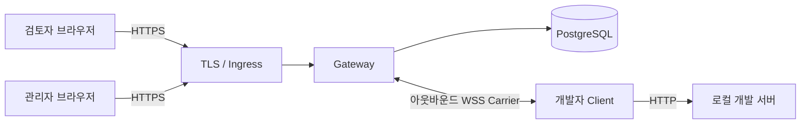

# Review Tunnel

[English](README.md) | 한국어

개발자의 로컬 웹 개발 서버를 별도로 배포하거나 개발자 PC의 인바운드 포트를 열지 않고, 인증된 사내 검토자에게 공유하는 도구입니다.

> [!IMPORTANT]
> 버전 `0.1.0`은 보안 MVP 코드 구현을 완료했습니다. 실제 운영 전에는 환경별 DNS, TLS, Ingress, secret, 백업·복구, 운영 인수 작업이 필요합니다.

## 빠른 시작

준비 사항: Node.js 24 이상, npm, 로컬 HTTP 개발 서버.

1. Review Tunnel을 설치합니다.

```bash
git clone git@github.com:ddussi/lotur.git
cd lotur
npm ci
```

2. 자신의 웹 프로젝트를 실행합니다. 아래에서는 `http://127.0.0.1:3000`을 사용한다고 가정합니다.

```bash
# 자신의 웹 프로젝트에서 실행합니다.
npm run dev
```

3. 서로 다른 터미널에서 Gateway와 Client를 실행합니다.

```bash
# 터미널 2
npm run dev:gateway

# 터미널 3
npm run dev:client -- http://127.0.0.1:3000
```

Client가 출력한 `http://<tunnel-id>.localhost:8787/` URL을 브라우저로 엽니다. 공유를 닫으려면 Client 터미널에서 `Ctrl+C`를 누릅니다.

> [!WARNING]
> 빠른 시작에는 인증과 TLS가 없으며 loopback에만 바인딩됩니다. 실제 공유에는 인증된 배포 환경을 사용하세요.

## 주요 기능

- HTTP, 요청·응답 body 스트리밍, SSE, WebSocket 중계
- 공유마다 생성되는 임시 하위 도메인 URL
- 공개 가입 없는 `ADMIN`, `DEVELOPER`, `REVIEWER` 내부 계정
- 수명이 짧고 한 번만 사용할 수 있는 Carrier credential
- 2분 재연결 유예 동안 동일 URL 복구
- PostgreSQL에 저장되는 감사 기록, 배포 admission, 전역 kill switch
- Vite 8과 Next.js 16 호환성 검사

## 아키텍처



검토 URL은 `*.preview.example.com` 같은 콘텐츠 경계를 사용합니다. 로그인, 관리자 기능, Carrier는 `control.example.net`처럼 별도 사이트 경계를 사용해 애플리케이션 Cookie와 인증 Cookie를 분리합니다.

## 인증된 환경에서 사용하기

| 역할 | 하는 일 |
| --- | --- |
| `ADMIN` | 계정 생성, admission, kill switch 관리 |
| `DEVELOPER` | Client를 실행하고 로컬 프로젝트 공유 |
| `REVIEWER` | 로그인 후 생성된 URL 열기 |

최초 관리자는 서버의 Admin CLI로 생성합니다.

```bash
npm run admin -- migrate
npm run admin -- bootstrap --username admin --display-name "운영 관리자"
npm run admin -- change-password --username admin
```

개발자는 다음과 같이 배포된 Gateway에 연결합니다.

```bash
GATEWAY_URL=wss://control.example.net/_review-tunnel/carrier \
CONTROL_URL=https://control.example.net \
npm run dev:client -- http://127.0.0.1:3000 --username developer1
```

Client가 비밀번호를 입력받아 공유 URL을 출력하면, 검토자는 해당 URL을 열고 `REVIEWER` 역할이 있는 계정으로 로그인합니다.

계정 생성, 역할, 비밀번호 초기화, 회수 절차는 [내부 계정 운영 문서](docs/internal-account-operations.md)를 확인하세요.

## 운영 배포

운영 환경에는 PostgreSQL 15 이상, TLS 종료 Ingress, wildcard 콘텐츠 DNS, 별도 control 도메인, 예약된 canary host, secret 관리가 필요합니다. `Dockerfile`은 `gateway`, `admin-cli`, `client`, `canary-check`, `db-backup`, `db-restore` target을 제공합니다.

Public-path canary가 성공하고 관리자가 동일한 배포 ID와 설정 digest를 별도로 승인하기 전까지 신규 공유는 열리지 않습니다. Kill switch, canary 결과, 승인은 PostgreSQL에 저장됩니다.

전체 환경변수, Docker 명령, canary 승인, 백업·복구, rollback은 [Linux 배포 문서](docs/linux-deployment.md)를 따르세요. [.env.example](.env.example)은 참고용이며 애플리케이션이 `.env` 파일을 자동으로 불러오지는 않습니다.

## 개발 및 검증

```bash
npm run check
npm run check:mvp
```

PostgreSQL 실연동 테스트 절차는 [배포 문서](docs/linux-deployment.md#배포-전-자동-검증)에 있습니다. `TEST_DATABASE_URL`에 운영 DB를 지정하면 안 됩니다.

## 문서

- [English README](README.md)
- [제품·아키텍처 기획](docs/review-tunnel-plan.md)
- [보안 MVP 구현 상태](docs/poc-status.md)
- [내부 계정 운영](docs/internal-account-operations.md)
- [Linux 배포](docs/linux-deployment.md)
