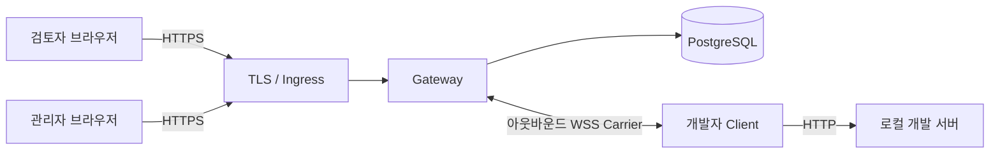

# Review Tunnel

[English](README.md) | 한국어

개발 중인 웹사이트를 인증된 검토자에게 공유하고, 검토 중인 페이지의 맥락에 맞춰 피드백을 받는 도구입니다.

Review Tunnel은 범용 터널보다 리뷰 작업 흐름에 집중합니다. 개발자는 로컬 화면을 공유하고, 검토자는 별도 프로그램 설치 없이 브라우저에서 페이지 또는 특정 영역에 댓글을 남기며, 개발자는 수정과 답변 및 해결 처리를 이어갑니다.

> [!IMPORTANT]
> 버전 `0.1.0`은 안전한 공유 기반을 구현한 상태입니다. 아래의 화면 댓글 오버레이는 다음 제품 단계이며 아직 구현되지 않았습니다. 실제 운영 전에는 환경별 DNS, TLS, Ingress, secret, 백업·복구, 운영 인수 작업도 필요합니다.

## 제품 방향

목표로 하는 사용 흐름은 다음과 같습니다.

1. 개발자가 로컬 웹 애플리케이션을 실행하고 인증된 공유를 시작합니다.
2. 검토자가 생성된 URL을 브라우저에서 열고 로그인합니다.
3. 검토자가 페이지 전체에 대한 댓글을 남기거나 특정 영역에 번호 핀을 놓습니다.
4. 개발자가 답글을 남기고 화면을 수정한 뒤 댓글을 해결 처리합니다.
5. 댓글은 일회성 Tunnel ID가 아니라 안정적인 프로젝트와 리뷰 버전에 연결됩니다.

한 문장으로는 **“로컬 웹앱을 안전하게 공유하고, 화면 위에서 바로 리뷰받는다”**가 제품의 약속입니다.

제안된 사용자 경험, 범위, 데이터 모델, 보안 경계와 구현 순서는 [화면 맥락 리뷰 설계](docs/contextual-review.md)에 정리했습니다.

## 운영 구성

Review Tunnel을 사용하려면 Linux 서버, PostgreSQL, DNS와 TLS 설정이 필요합니다. 하나의 기준 도메인 아래에 DNS 이름 두 개를 만듭니다.

```text
control.tunnel.example.com             로그인·관리·Client 연결
*.preview.tunnel.example.com           공유 화면
```

`control`은 공유 화면 wildcard인 `*.preview...` 바깥에 둡니다. 어떤 기준 도메인을 사용할지는 운영자가 정합니다. 다른 서비스와 상위 도메인을 공유하면 그 서비스의 `Domain` Cookie가 공유 화면 요청에 포함될 수 있으므로 기존 Cookie 정책을 확인해야 합니다.

## 현재 범위와 예정 범위

### `0.1.0`에서 구현됨

- HTTP, 요청·응답 body 스트리밍, SSE, WebSocket 중계
- 공유마다 발급되는 임시 하위 도메인 URL
- 공개 가입 없이 관리자가 발급하는 `ADMIN`, `DEVELOPER`, `REVIEWER` 계정
- 수명이 짧고 한 번만 사용할 수 있는 Carrier credential
- 2분 재연결 유예 동안 동일 URL 복구
- PostgreSQL에 저장되는 감사 기록, 배포 admission, 전역 kill switch
- Vite 8과 Next.js 16 호환성 검사

### 다음 제품 단계

- 페이지 경로에 연결되는 댓글
- 클릭한 영역에 표시되는 번호 핀
- 답글과 미해결·해결 상태
- 안정적인 프로젝트 및 리뷰 버전 연결
- 검토 대상 애플리케이션과 스타일·동작이 충돌하지 않는 격리 오버레이

첫 리뷰 버전에서는 요소를 픽셀 단위로 완벽하게 추적하거나 스크린샷, 멘션, Pull Request 연동까지 제공한다고 약속하지 않습니다. 페이지·영역 댓글 흐름을 먼저 검증한 뒤 확장합니다.

## 인증형 Gateway 아키텍처



운영형 검토 URL은 `*.preview.tunnel.example.com`을 사용하고, 로그인·관리·Carrier는 `control.tunnel.example.com`을 사용합니다. 둘은 같은 기준 도메인 아래에 있지만 host가 다릅니다. 인증 Cookie는 host 전용이고, 상태 변경 요청은 정확한 `Origin`만 허용하며, Gateway가 예약한 Cookie는 로컬 앱에 전달하지 않습니다.

## 인증된 환경에서 사용하기

| 역할 | 하는 일 |
| --- | --- |
| `ADMIN` | 계정 생성, admission, kill switch 관리 |
| `DEVELOPER` | Client를 실행하고 로컬 프로젝트 공유 |
| `REVIEWER` | 로그인 후 생성된 URL 열기 |

최초 관리자는 서버의 Admin CLI로 생성합니다.

```bash
npm run admin -- migrate
npm run admin -- bootstrap --username admin --display-name "운영 관리자"
npm run admin -- change-password --username admin
```

개발자는 다음과 같이 배포된 Gateway에 연결합니다.

```bash
GATEWAY_URL=wss://control.tunnel.example.com/_review-tunnel/carrier \
CONTROL_URL=https://control.tunnel.example.com \
npm run share -- http://127.0.0.1:3000 --username developer1
```

Client가 비밀번호를 입력받아 공유 URL을 출력하면, 검토자는 해당 URL을 열고 `REVIEWER` 역할이 있는 계정으로 로그인합니다.

계정 생성, 역할, 비밀번호 초기화, 회수 절차는 [관리자 발급 계정 운영 문서](docs/internal-account-operations.md)를 확인하세요.

## 운영 배포

운영 환경에는 PostgreSQL 15 이상, TLS 종료 Ingress, 하나의 기준 도메인 아래에 구성한 control·wildcard DNS, 예약된 canary host, secret 관리가 필요합니다. `Dockerfile`은 `gateway`, `admin-cli`, `client`, `canary-check`, `db-backup`, `db-restore` target을 제공합니다.

Public-path canary가 성공하고 관리자가 동일한 배포 ID와 설정 digest를 별도로 승인하기 전까지 신규 공유는 열리지 않습니다. Kill switch, canary 결과, 승인은 PostgreSQL에 저장됩니다.

전체 환경변수, Docker 명령, canary 승인, 백업·복구, rollback은 [Linux 배포 문서](docs/linux-deployment.md)를 따르세요. [.env.example](.env.example)은 참고용이며 애플리케이션이 `.env` 파일을 자동으로 불러오지는 않습니다.

준비물과 처음부터 실행하는 순서는 [처음 사용하는 사람을 위한 시작 안내](docs/getting-started.md)에 모아 두었습니다.

## 개발 및 검증

```bash
npm run check
npm run check:mvp
```

PostgreSQL 실연동 테스트 절차는 [배포 문서](docs/linux-deployment.md#배포-전-자동-검증)에 있습니다. `TEST_DATABASE_URL`에 운영 DB를 지정하면 안 됩니다.

## 문서

- [English README](README.md)
- [화면 맥락 리뷰 제품·기술 설계](docs/contextual-review.md)
- [처음 사용하는 사람을 위한 시작 안내](docs/getting-started.md)
- [제품·아키텍처 기획](docs/review-tunnel-plan.md)
- [보안 MVP 구현 상태](docs/poc-status.md)
- [관리자 발급 계정 운영](docs/internal-account-operations.md)
- [Linux 배포](docs/linux-deployment.md)
