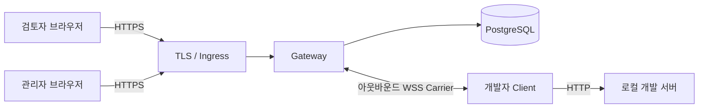

# Review Tunnel

[English](README.md) | 한국어

개발 중인 웹사이트를 다른 기기에서 바로 열어 보는 도구입니다.

- 도메인이 없으면 신뢰할 수 있는 같은 로컬 네트워크의 휴대폰이나 다른 컴퓨터에 공유합니다.
- 도메인이 하나 있으면 인증형 Gateway를 구성해 다른 네트워크의 사용자에게도 공유합니다.

> [!IMPORTANT]
> 버전 `0.1.0`은 보안 MVP 코드 구현을 완료했습니다. 실제 운영 전에는 환경별 DNS, TLS, Ingress, secret, 백업·복구, 운영 인수 작업이 필요합니다.

## 1분 빠른 시작: 도메인 없이 로컬 네트워크 공유

준비 사항: Node.js 24 이상, npm, 로컬 HTTP 개발 서버.

1. Review Tunnel을 설치합니다.

```bash
git clone https://github.com/ddussi/lotur.git
cd lotur
npm ci
```

2. 자신의 웹 프로젝트를 실행합니다. 아래에서는 `http://127.0.0.1:3000`을 사용한다고 가정합니다.

```bash
# 자신의 웹 프로젝트에서 실행합니다.
npm run dev
```

3. Review Tunnel 폴더의 다른 터미널에서 다음 명령 하나를 실행합니다.

```bash
npm run share:lan -- http://127.0.0.1:3000
```

화면에 나온 `http://192.168...` 공유 주소를 같은 로컬 네트워크에 연결된 휴대폰이나 다른 컴퓨터에서 엽니다. 공유를 닫으려면 `Ctrl+C`를 누릅니다.

> [!WARNING]
> 이 방식에는 로그인과 암호화가 없습니다. 신뢰할 수 있는 로컬 네트워크에서만 사용하세요. 프로그램은 같은 Wi-Fi 이름이나 서브넷을 검사하지 않으므로 해당 IP와 포트에 접근 가능한 기기는 공유 화면을 열 수 있습니다. 연결할 네트워크 주소를 잘못 골랐다면 `--host 192.168.0.23`처럼 직접 지정할 수 있습니다.

## 사용 방법은 두 가지뿐입니다

| 상황 | 준비할 것 | 공유 범위 |
| --- | --- | --- |
| 도메인 없음 | Node.js 24+, 신뢰할 수 있는 로컬 네트워크 | 선택한 사설 IP에 접근 가능한 네트워크 |
| 사용할 도메인 1개 있음 | Linux 서버, PostgreSQL, DNS·TLS 설정 | 인터넷 또는 사설망 |

두 번째 방식은 하나의 기준 도메인 아래에 DNS 이름 두 개를 만듭니다.

```text
control.tunnel.example.com             로그인·관리·Client 연결
*.preview.tunnel.example.com           공유 화면
```

`control`은 공유 화면 wildcard인 `*.preview...` 바깥에 둡니다. 어떤 기준 도메인을 사용할지는 운영자가 정합니다. 다른 서비스와 상위 도메인을 공유하면 그 서비스의 `Domain` Cookie가 공유 화면 요청에 포함될 수 있으므로 기존 Cookie 정책을 확인해야 합니다.

## 주요 기능

- HTTP, 요청·응답 body 스트리밍, SSE, WebSocket 중계
- 로컬 네트워크용 임시 IP 주소 또는 운영용 임시 하위 도메인 URL
- 공개 가입 없이 관리자가 발급하는 `ADMIN`, `DEVELOPER`, `REVIEWER` 계정
- 수명이 짧고 한 번만 사용할 수 있는 Carrier credential
- 2분 재연결 유예 동안 동일 URL 복구
- PostgreSQL에 저장되는 감사 기록, 배포 admission, 전역 kill switch
- Vite 8과 Next.js 16 호환성 검사

## 인증형 Gateway 아키텍처



운영형 검토 URL은 `*.preview.tunnel.example.com`을 사용하고, 로그인·관리·Carrier는 `control.tunnel.example.com`을 사용합니다. 둘은 같은 기준 도메인 아래에 있지만 host가 다릅니다. 인증 Cookie는 host 전용이고, 상태 변경 요청은 정확한 `Origin`만 허용하며, Gateway가 예약한 Cookie는 로컬 앱에 전달하지 않습니다.

로컬 네트워크 모드에서는 다른 기기의 브라우저가 개발자 컴퓨터에서 임시로 실행되는 Gateway에 직접 연결하며 PostgreSQL, DNS, TLS, 계정이 필요하지 않습니다.

## 인증된 환경에서 사용하기

| 역할 | 하는 일 |
| --- | --- |
| `ADMIN` | 계정 생성, admission, kill switch 관리 |
| `DEVELOPER` | Client를 실행하고 로컬 프로젝트 공유 |
| `REVIEWER` | 로그인 후 생성된 URL 열기 |

최초 관리자는 서버의 Admin CLI로 생성합니다.

```bash
npm run admin -- migrate
npm run admin -- bootstrap --username admin --display-name "운영 관리자"
npm run admin -- change-password --username admin
```

개발자는 다음과 같이 배포된 Gateway에 연결합니다.

```bash
GATEWAY_URL=wss://control.tunnel.example.com/_review-tunnel/carrier \
CONTROL_URL=https://control.tunnel.example.com \
npm run share -- http://127.0.0.1:3000 --username developer1
```

Client가 비밀번호를 입력받아 공유 URL을 출력하면, 검토자는 해당 URL을 열고 `REVIEWER` 역할이 있는 계정으로 로그인합니다.

계정 생성, 역할, 비밀번호 초기화, 회수 절차는 [관리자 발급 계정 운영 문서](docs/internal-account-operations.md)를 확인하세요.

## 운영 배포

운영 환경에는 PostgreSQL 15 이상, TLS 종료 Ingress, 하나의 기준 도메인 아래에 구성한 control·wildcard DNS, 예약된 canary host, secret 관리가 필요합니다. `Dockerfile`은 `gateway`, `admin-cli`, `client`, `canary-check`, `db-backup`, `db-restore` target을 제공합니다.

Public-path canary가 성공하고 관리자가 동일한 배포 ID와 설정 digest를 별도로 승인하기 전까지 신규 공유는 열리지 않습니다. Kill switch, canary 결과, 승인은 PostgreSQL에 저장됩니다.

전체 환경변수, Docker 명령, canary 승인, 백업·복구, rollback은 [Linux 배포 문서](docs/linux-deployment.md)를 따르세요. [.env.example](.env.example)은 참고용이며 애플리케이션이 `.env` 파일을 자동으로 불러오지는 않습니다.

두 방식의 준비물과 처음부터 실행하는 순서는 [처음 사용하는 사람을 위한 시작 안내](docs/getting-started.md)에 모아 두었습니다.

## 개발 및 검증

```bash
npm run check
npm run check:mvp
```

PostgreSQL 실연동 테스트 절차는 [배포 문서](docs/linux-deployment.md#배포-전-자동-검증)에 있습니다. `TEST_DATABASE_URL`에 운영 DB를 지정하면 안 됩니다.

## 문서

- [English README](README.md)
- [처음 사용하는 사람을 위한 시작 안내](docs/getting-started.md)
- [제품·아키텍처 기획](docs/review-tunnel-plan.md)
- [보안 MVP 구현 상태](docs/poc-status.md)
- [관리자 발급 계정 운영](docs/internal-account-operations.md)
- [Linux 배포](docs/linux-deployment.md)
