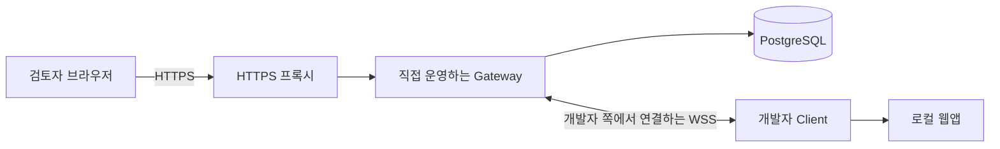

# Review Tunnel

[English](README.md) | 한국어

내 컴퓨터에서 개발 중인 웹사이트를 **직접 운영하는 서버와 도메인으로 연결해, 로그인한 검토자에게 공유하는 도구**입니다. 검토자는 브라우저로 화면을 사용하고, 개발자는 평소처럼 코드를 수정합니다. Vite HMR과 Next.js Fast Refresh를 통한 변경 반영도 지원합니다.

**현재 상태: `0.1.0` 알파.** HTTP·스트리밍·WebSocket 중계, 계정 관리, 임시 공유 기능을 구현했습니다. 화면 댓글·영역 핀·프로젝트별 접근 권한은 아직 없습니다. 실제 검사 범위는 [검증 보고서](docs/validation/public-https-2026-09-06.md)에서 확인할 수 있습니다.

## 실제 사용 흐름

1. 운영자가 서버·DB·도메인·HTTPS를 준비하고 개발자와 검토자 계정을 만듭니다.
2. 개발자가 자기 컴퓨터에서 웹앱을 실행하고 공유 명령을 실행합니다.
3. 출력된 임시 주소를 검토자에게 전달하면, 검토자가 브라우저에서 로그인합니다.
4. 검토자가 직접 화면을 사용하고 개발자가 코드를 수정합니다. 현재 피드백은 메신저나 통화 등으로 주고받습니다.
5. 개발자가 공유 터미널에서 `Ctrl+C`를 누르면 공유가 끝납니다.



이 저장소는 직접 설치하는 소프트웨어를 제공합니다. 유지보수자의 서버·도메인이나 공개 가입 서비스를 제공하지 않습니다. 운영자는 자신의 인프라를 사용하며, 이미 설치된 서버를 이용하는 개발자와 검토자는 도메인을 따로 구매할 필요가 없습니다.

## 이미 설치된 서버로 공유하기

준비물은 Node.js 24 이상, 내려받은 저장소, 실행 중인 웹앱, 초기 비밀번호 변경을 완료한 `DEVELOPER` 계정입니다. 아래 명령은 **Review Tunnel 저장소 폴더**에서 실행합니다. 공유할 웹앱은 다른 터미널에서 계속 실행해 둡니다.

```sh
npm ci
npm run share -- http://127.0.0.1:3000 \
  --gateway wss://control.tunnel.example.com/_review-tunnel/carrier \
  --username developer1
```

도메인은 운영자가 알려준 주소로, `3000`은 웹앱이 실행 중인 포트로 바꿉니다. 비밀번호를 입력하면 `https://<발급된-ID>.preview.tunnel.example.com/` 형태의 공유 주소가 나옵니다. 검토자는 그 주소에서 `REVIEWER` 계정으로 로그인합니다.

현재 npm 메타데이터에서 저장소와 하위 패키지는 `private`입니다. 소스를 내려받거나 문서의 Docker 이미지를 직접 빌드해서 사용합니다. 전역 설치용 npm 명령은 이 알파 버전의 배포 방법에 포함하지 않습니다.

## 내 서버에 처음 설치하기

Linux 서버, PostgreSQL 15 이상, DNS 설정 권한, 두 이름을 포함하는 TLS 인증서, 스트리밍과 WebSocket을 지원하는 HTTPS 프록시가 필요합니다.

```text
control.tunnel.example.com             로그인·관리·Client 연결
*.preview.tunnel.example.com           공유마다 발급되는 주소
canary.preview.tunnel.example.com      외부 연결 검사 전용 주소
```

모두 설명용 주소이며 실제 접속 주소가 아닙니다. `*` 설정은 새 공유 주소들을 한꺼번에 처리하므로 공유할 때마다 DNS를 추가할 필요가 없습니다. 로그인 주소는 콘텐츠 wildcard 바깥에 둡니다.

[처음 사용하는 사람을 위한 시작 안내](docs/getting-started.md)를 먼저 읽고, 상세한 운영 설정은 [Linux 배포 문서](docs/linux-deployment.md)를 따르세요. [.env.example](.env.example)은 설정 참고 자료이며 애플리케이션이 `.env` 파일을 자동으로 읽지는 않습니다.

서버는 외부 경로 검사인 canary가 통과하고 관리자가 해당 배포를 별도로 승인한 뒤에 공유를 허용합니다.

## 현재 기능과 제한

| 구현된 기능 | 적용 범위 |
| --- | --- |
| HTTP·업로드와 응답 스트리밍·SSE·WebSocket | Client 하나가 자기 컴퓨터의 HTTP 웹서버 주소 하나를 통째로 공유 |
| 관리자 발급 계정·호스트별 로그인 쿠키 | 검토자 권한은 서버 전체에 적용. 프로젝트별 초대·접근 목록은 미구현 |
| 임시 공유 주소·인증된 재연결 | 최대 8시간, 진행 중인 연결이 없는 상태에서 30분 미사용 시 종료, 재연결 유예 2분 |
| 계정 세션 종료·전체 공유 중지 | 권한 변경은 주기적으로 반영. 세션 종료만 하면 새 로그인은 가능하며 지속 차단은 계정 정지·권한 제거로 수행 |
| DB에 계정·운영 설정 저장 | 실행 중인 공유 연결은 Gateway 메모리에 있어 Gateway 재시작 시 종료 |
| Vite·Next.js 실제 브라우저 검사 | 확인한 버전·환경은 검증 보고서에 기록. 다른 조합은 추가 검사 필요 |

개발자가 공유 주소도 열어 보려면 `DEVELOPER`와 `REVIEWER` 권한이 모두 필요합니다. 배포는 Gateway 한 개를 기준으로 합니다. DB를 함께 쓴다고 여러 Gateway가 실행 중인 공유를 자동으로 나눠 처리하지는 않습니다.

공유한 웹앱의 자체 로그인·데이터 변경 기능은 그대로 작동합니다. 검토에 맞는 테스트 데이터를 사용하세요. 자세한 경계는 [보안 문서](SECURITY.md)에 정리했습니다.

## 개발과 기여

```sh
npm ci
npm run check
```

DB·Chrome까지 포함한 전체 검사는 [기여 안내](CONTRIBUTING.md)를 따르세요. `TEST_DATABASE_URL`이 없으면 PostgreSQL 실연동 검사는 명시적으로 건너뜁니다. 설치한 서버의 실제 HTTPS 경로는 [외부 경로 검사 안내](docs/public-path-testing.md)로 검증합니다.

버그를 제보할 때는 재현 방법과 검사 결과를 포함해 주세요. [기여 안내](CONTRIBUTING.md), [보안 제보](SECURITY.md), [변경 기록](CHANGELOG.md)을 확인할 수 있습니다.

## 이후 계획과 상세 문서

페이지 댓글, 번호가 붙은 영역 핀, 답글, 해결 상태, 프로젝트·리뷰 버전 연결은 **아직 구현되지 않은 계획**입니다. [화면 맥락 리뷰 설계](docs/contextual-review.md)에 예정 범위를 기록했습니다.

- [English setup guide](docs/getting-started.en.md)
- [관리자 발급 계정 운영](docs/internal-account-operations.md)
- [구현 상태](docs/poc-status.md)
- [전체 코드 리뷰](docs/code-review-2026-09-06.md)
- [제품·아키텍처 기획](docs/review-tunnel-plan.md)
- [릴리스 절차](docs/releasing.md)

## 라이선스

[MIT](LICENSE). 외부 의존성에는 각 프로젝트의 라이선스가 적용됩니다.
