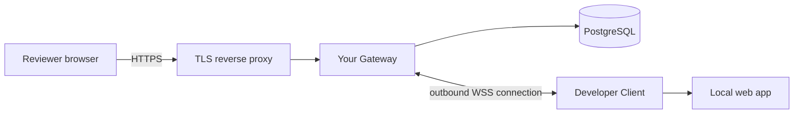

# Review Tunnel

English | [한국어](README.ko.md)

Share a web application running on your computer with authenticated reviewers through a server and domain you operate. Reviewers use their browsers; developers keep working locally and can show changes through Vite HMR or Next.js Fast Refresh.

**Status: alpha development; no tagged release yet.** HTTP, streaming, WebSocket, accounts, and temporary sharing are implemented, together with page comments, responsive pins, filters, a persistent review inbox, internal notifications, and re-review. Per-project access lists remain unimplemented. The source package version is `0.1.0`; the first distributable alpha is being prepared. See the [current implementation status](docs/poc-status.md) and [documentation index](docs/documentation.md).

## How it works

1. An operator deploys a Gateway with PostgreSQL, DNS, and HTTPS, then issues developer and reviewer accounts.
2. A developer runs a local web app and starts the Review Tunnel Client.
3. The Client prints a temporary HTTPS URL. A reviewer opens it and signs in.
4. The reviewer interacts with the app while the developer makes changes. With review mode enabled, they can leave comments and region pins, reply, and resolve threads directly on the page.
5. The developer stops the Client with `Ctrl+C` to end the share.



This repository provides self-hosted software. It does not include a hosted Gateway, a public sign-up service, or a domain supplied by the maintainers. Each operator chooses their own infrastructure. A reviewer needs only a browser and an account; developers using an existing Gateway do not need to buy a domain.

## Try it locally

With Node.js 24+, local Docker Engine 28+ / Compose, and Chrome, run from this checkout:

```sh
npm ci
npm run demo
```

Open the printed shared app URL and use `npm run demo -- credentials` in another terminal to get your local reviewer and developer passwords. The demo includes a Vite example and a dedicated database; saved reviews survive stopping and restarting it. URLs work only on this computer. Follow the [local demo guide](docs/local-demo.en.md) for the two-user walkthrough, ports, and data deletion.

## Start sharing with an existing Gateway

Prerequisites: Node.js 24+, a checkout of this repository, a running local web app, and a `DEVELOPER` account whose initial password has been changed. Commands below run from the repository root. Keep the web app running in another terminal.

```sh
npm ci
npm run share -- http://127.0.0.1:3000 \
  --gateway wss://control.tunnel.example.com/_review-tunnel/carrier \
  --username developer1
```

Replace the Gateway hostname with the one provided by your operator and `3000` with your app's port. Enter your password at the prompt. Send the generated URL to a user with the `REVIEWER` role. Content URLs have the shape `https://<generated-id>.preview.tunnel.example.com/`.

To use the Client without a source checkout on the developer's computer, [build and install its standalone archive](docs/client-installation.en.md). The private npm metadata prevents accidental registry publication; archive installation is supported. The optional `@review-tunnel/vite` and `@review-tunnel/next` packages can also be built as local tarballs. No npm registry release is assumed.

## Review directly on the page

Enable the development integration in your app (or explicitly add the bootstrap script), then start a share with both a stable project name and a revision key:

```sh
npm run share -- http://127.0.0.1:3000 \
  --gateway wss://control.tunnel.example.com/_review-tunnel/carrier \
  --username developer1 --review-project storefront --review-revision 4a1b2c3d
```

The URL is printed only after the tunnel and review binding both succeed. Page comments, numbered region pins, replies, resolution, author edits, deletion markers, participant mentions, and recipient-only internal notifications live in a sidebar. PostgreSQL preserves feedback for the same owner, project, and revision when a new share is opened. Live updates use a separate review SSE connection.

Use **Hide all pins** to clear the page, then **Show pin** on a comment to display just that pin. New pins follow a uniquely identified element (`data-review-id`, or `id`) when the selection fits inside it. The sidebar explains when a target is unavailable or a coordinate-only pin cannot be placed at the current screen size. See [pin placement and visibility](docs/getting-started.en.md#pin-placement-and-visibility) for setup and limitations.

Follow the [review setup instructions](docs/getting-started.en.md#enable-page-and-region-reviews) for local package installation, Vite/Next configuration, and CSP nonce handling.

## Continue in the review inbox

Open `/reviews` on the control host to find feedback by project, revision, page, status, or author. Permanent comment links work after a share ends and return to the comment after sign-in. Saved comments and permitted edits remain available while the app is offline. **Open in app** finds active shares of the same revision on the current Gateway.

When re-review is enabled, a developer chooses **Request review**, and the original author confirms the fix or asks for more changes. The inbox keeps processing history and combines your mention, reply, and workflow notifications across projects. Follow the [review guide](docs/review-guide.en.md) for the complete workflow and operator setup.

Live updates and filter changes preserve drafts in the current tab. Reloading or closing that tab loses unsaved drafts. These saved review records and current-tab drafts have different lifetimes.

## Set up your own Gateway

You need a Linux server, PostgreSQL 15+, control and wildcard DNS records, TLS certificates covering both names, and a reverse proxy that supports request streaming, SSE, and WebSocket upgrades.

```text
control.tunnel.example.com             login, administration, Client connection
*.preview.tunnel.example.com           generated share URLs
canary.preview.tunnel.example.com      reserved public-path check
```

These are documentation placeholders, not working endpoints. The wildcard covers new shares without a DNS change for every URL. The control hostname must remain outside the content wildcard.

Follow the [English setup guide](docs/getting-started.en.md) or [한국어 시작 안내](docs/getting-started.md). The detailed [Linux deployment runbook (Korean)](docs/linux-deployment.md) covers runtime limits, Docker targets, secrets, backup/restore, and rollback. [.env.example](.env.example) is a configuration reference; the application does not automatically load `.env` files.

For automatic deployment after a successful `main` build, configure the [GitHub Actions deployment pipeline](docs/automatic-deployment.md). It publishes pinned images to GHCR, updates the configured Linux Gateway over SSH, verifies the public path, and restores the previous container if the rollout fails.

New shares remain closed until the public-path canary passes and an administrator or configured deployment pipeline separately approves the exact deployment ID and configuration digest.

## Features and current limits

| Available | Current boundary |
| --- | --- |
| HTTP, request/response streaming, SSE, WebSocket | One loopback HTTP origin per Client; the complete origin is shared |
| Administrator-issued accounts and host-only login cookies | `DEVELOPER` and `REVIEWER` content access is deployment-wide; no per-project invitations or access lists |
| Temporary share URLs and authenticated reconnect | Maximum lifetime 8 hours; idle timeout 30 minutes when no streams remain; reconnect grace 2 minutes |
| Account revocation and a global kill switch | Role checks propagate periodically; session revocation permits a later fresh login unless the account is disabled or its role removed |
| PostgreSQL-backed accounts, reviews, and operational state | Active tunnels live in Gateway memory and end on Gateway restart |
| Vite and Next.js browser verification | Tested versions and environments are recorded in the validation report; other combinations need verification |

Either `DEVELOPER` or `REVIEWER` grants content access; `ADMIN` alone does not. Plan deployments around a single Gateway instance; PostgreSQL persistence alone does not provide shared tunnel routing across replicas.

The application on the shared origin keeps its own authorization and data behavior. Use data appropriate for reviewers. See [security boundaries and reporting](SECURITY.md).

## Development and contributions

```sh
npm ci
npm run check
```

For the full suite, including a disposable PostgreSQL database and Chrome, follow [CONTRIBUTING.md](CONTRIBUTING.md). Without `TEST_DATABASE_URL`, PostgreSQL integration tests are explicitly skipped. To verify a deployed Gateway, use the [public HTTPS testing guide](docs/public-path-testing.md).

Bug reports and pull requests should include a minimal reproduction and relevant test results. See [contribution guidelines](CONTRIBUTING.md), [security reporting](SECURITY.md), and the [changelog](CHANGELOG.md).

## Roadmap and documentation

Per-project access lists, screenshots, external email/Slack/push notifications, automatic comment carry-over between revisions, and complete edit history remain outside the current scope. The [contextual review design (Korean)](docs/contextual-review.md) describes implemented review behavior and deferred work.

- [Current guides and historical records](docs/documentation.md)
- [Review workflow](docs/review-guide.en.md)
- [Account operations (Korean)](docs/internal-account-operations.md)
- [Implementation status (Korean)](docs/poc-status.md)
- [Code review findings (Korean)](docs/code-review-2026-09-06.md)
- [Architecture plan (Korean)](docs/review-tunnel-plan.md)
- [Release procedure](docs/releasing.md)

## License

[MIT](LICENSE). Third-party dependencies remain under their respective licenses.
