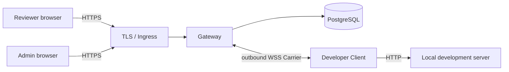

# Review Tunnel

English | [한국어](README.ko.md)

Share a local web application with authenticated reviewers and collect feedback in the context of the page being reviewed.

Review Tunnel is moving from a general-purpose tunnel toward a focused review workflow: a developer shares a local preview, reviewers open it without installing a client, and page or region comments stay attached to the relevant review revision.

> [!IMPORTANT]
> The current source tree implements the secure sharing foundation and the contextual-review MVP: page and region comments, replies, optimistic edit/delete tombstones, resolve/reopen, Review SSE, participant mentions, internal notifications, and first-party Vite/Next integrations. DNS, TLS, Ingress, secrets, backup/restore, and operational acceptance must still be completed in each production environment.

## Product direction

The intended workflow is deliberately narrower than a generic public tunnel:

1. A developer runs a local web application and starts an authenticated share.
2. A reviewer opens the generated URL in a browser and signs in.
3. The reviewer leaves a page comment or places a numbered pin on a region.
4. The developer replies, updates the page, and resolves the thread.
5. Feedback remains associated with a stable project and review revision rather than an ephemeral tunnel ID.

The short product promise is: **share a local web app securely and review it directly on the page.**

See [Contextual review design](docs/contextual-review.md) for the proposed experience, scope, data model, security boundaries, and delivery plan.

## Deployment model

Review Tunnel requires a Linux server, PostgreSQL, DNS, and TLS. It uses two DNS names under one base domain:

```text
control.tunnel.example.com             login, administration, Client connection
*.preview.tunnel.example.com           shared applications
```

The operator chooses the base domain. If it shares a parent domain with another service, review that service's `Domain` cookies because the browser may include them in requests to preview hosts.

## Current and planned scope

### Available in `0.1.0`

- HTTP, streaming request/response bodies, SSE, and WebSocket relay
- Temporary hosted subdomain URL for each share
- Administrator-issued `ADMIN`, `DEVELOPER`, and `REVIEWER` accounts with no public sign-up
- Short-lived, single-use Carrier credentials
- Same-URL recovery during a two-minute reconnect window
- PostgreSQL-backed audit, deployment admission, and global kill switch
- Vite 8 and Next.js 16 compatibility checks

### Review features in the current source tree

- Comments attached to a page route
- Stable project and review revision association
- An isolated overlay that does not interfere with the reviewed application
- Explicit review binding by a `DEVELOPER`, with comments available to `DEVELOPER` and `REVIEWER` accounts
- PostgreSQL persistence isolated by project, revision, and route, including reuse from a new tunnel
- Plain-text replies from `DEVELOPER` and `REVIEWER` accounts
- Resolve/reopen controls for `DEVELOPER` accounts with concurrent status-conflict detection
- Click pins and drag-selected `REGION_V1` areas using normalized document coordinates
- Dedicated, replayable Review SSE updates with bounded connections and PostgreSQL retention
- Author-only edits, author-or-developer deletion, content versions, and persistent tombstones
- Participant-limited `@username` mentions with recipient-only internal notifications and read state
- `@review-tunnel/vite` and `@review-tunnel/next` development integrations

### Deliberately deferred

Pixel-perfect element tracking, screenshots, external email/Slack/push alerts, revision carry-over, complete edit history, and pull-request integration are outside the current scope.

## Authenticated Gateway architecture



Hosted review URLs use `*.preview.tunnel.example.com`; login, administration, and the Carrier use `control.tunnel.example.com`. Authentication cookies are host-only, mutations require the exact control `Origin`, and Gateway-reserved cookies are never forwarded to the local app.

## Authenticated use

| Role | What the user does |
| --- | --- |
| `ADMIN` | Creates accounts and controls admission or the kill switch |
| `DEVELOPER` | Runs the Client and shares a local project |
| `REVIEWER` | Signs in and opens the generated URL |

The first administrator is created from the server-side Admin CLI:

```bash
npm run admin -- migrate
npm run admin -- bootstrap --username admin --display-name "Operations Admin"
npm run admin -- change-password --username admin
```

A developer connects to the deployed Gateway with:

```bash
GATEWAY_URL=wss://control.tunnel.example.com/_review-tunnel/carrier \
CONTROL_URL=https://control.tunnel.example.com \
npm run share -- http://127.0.0.1:3000 --username developer1
```

The Client prompts for the password and prints the review URL after activation. A reviewer opens that URL and signs in with an account that has the `REVIEWER` role.

To enable page and region comments, explicitly include the Gateway bootstrap in a review-only HTML entry for the local app. The Gateway does not rewrite application HTML.

```html
<script type="module" src="/_review-tunnel/review/bootstrap.js"></script>
```

Then pass a project slug and an immutable revision key together. The Client prints the share URL only after both tunnel activation and review binding succeed; if binding fails, it closes the newly opened tunnel.

```bash
GATEWAY_URL=wss://control.tunnel.example.com/_review-tunnel/carrier \
CONTROL_URL=https://control.tunnel.example.com \
npm run share -- http://127.0.0.1:3000 --username developer1 \
  --review-project storefront --review-revision 4a1b2c3d
```

Without the bootstrap, the review data binding still exists but no sidebar is rendered. The first-party Vite plugin injects this bootstrap through Vite's HTML transform; the Next integration provides explicit root-layout script props and merges controlled `allowedDevOrigins`. See the [first-time guide](docs/getting-started.md#vite와-nextjs-integration).

Signed-in `DEVELOPER` and `REVIEWER` accounts can add page or region comments and replies in the sidebar. Authors can edit their own live content; authors and developers can delete it while preserving thread/reply tombstones. A `DEVELOPER` can resolve or reopen a thread. `@username` creates an internal notification only when the target is the project owner or an existing revision participant.

See [Administrator-issued account operations](docs/internal-account-operations.md) for account creation, roles, password reset, and revocation.

## Production deployment

Production requires PostgreSQL 15+, TLS-terminating Ingress, control and wildcard DNS names under one base domain, a reserved canary host, and secret management. The `Dockerfile` provides `gateway`, `admin-cli`, `client`, `canary-check`, `db-backup`, and `db-restore` targets.

New shares remain closed until the public-path canary succeeds and an administrator separately approves the exact deployment ID and configuration digest. The kill switch, canary result, and approval are stored in PostgreSQL.

Follow the [Linux deployment runbook](docs/linux-deployment.md) for environment variables, Docker commands, canary approval, backup/restore, and rollback. [.env.example](.env.example) is a reference only; the application does not automatically load `.env` files.

See the Korean [first-time user guide](docs/getting-started.md) for prerequisites and the complete setup flow.

## Development

```bash
npm run check
npm run check:mvp
```

The PostgreSQL integration-test procedure is documented in the [deployment runbook](docs/linux-deployment.md#배포-전-자동-검증). Never use a production database as `TEST_DATABASE_URL`.

## Documentation

- [Korean README](README.ko.md)
- [Contextual review product and technical design (Korean)](docs/contextual-review.md)
- [First-time user guide (Korean)](docs/getting-started.md)
- [Architecture plan](docs/review-tunnel-plan.md)
- [Security MVP status](docs/poc-status.md)
- [Account operations](docs/internal-account-operations.md)
- [Deployment runbook](docs/linux-deployment.md)

Detailed operational documents are currently maintained in Korean.
