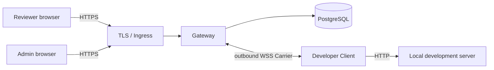

# Review Tunnel

English | [한국어](README.ko.md)

Open a local web project on another device. Share on a trusted local network without a domain, or use one domain for an authenticated Gateway deployment.

> [!IMPORTANT]
> Version `0.1.0` has completed the security MVP in code. DNS, TLS, Ingress, secrets, backup/restore, and operational acceptance must still be completed in each production environment.

## One-minute quick start: local network, no domain

Requirements: Node.js 24+, npm, and a local HTTP development server.

1. Install Review Tunnel.

```bash
git clone https://github.com/ddussi/lotur.git
cd lotur
npm ci
```

2. Run your web project. This guide assumes `http://127.0.0.1:3000`.

```bash
# Run in your web project.
npm run dev
```

3. In another terminal inside Review Tunnel, run one command.

```bash
npm run share:lan -- http://127.0.0.1:3000
```

Open the printed `http://192.168...` URL on a phone or computer connected to the same local network. Press `Ctrl+C` to close the share.

> [!WARNING]
> This mode has no login or TLS. Use it only on a trusted local network. Review Tunnel does not verify the Wi-Fi name or subnet, so any device that can reach the selected IP and port can open the share. If automatic interface selection is wrong, pass `--host 192.168.0.23`.

## Two supported modes

| Situation | What you provide | Reachability |
| --- | --- | --- |
| No domain | Node.js 24+ and a trusted local network | Networks that can reach the selected private IP |
| One available domain | Linux server, PostgreSQL, DNS and TLS | Internet or private network |

The hosted mode uses two DNS names under one base domain:

```text
control.tunnel.example.com             login, administration, Client connection
*.preview.tunnel.example.com           shared applications
```

The operator chooses the base domain. If it shares a parent domain with another service, review that service's `Domain` cookies because the browser may include them in requests to preview hosts.

## Features

- HTTP, streaming request/response bodies, SSE, and WebSocket relay
- Temporary LAN-IP or hosted subdomain URL for each share
- Administrator-issued `ADMIN`, `DEVELOPER`, and `REVIEWER` accounts with no public sign-up
- Short-lived, single-use Carrier credentials
- Same-URL recovery during a two-minute reconnect window
- PostgreSQL-backed audit, deployment admission, and global kill switch
- Vite 8 and Next.js 16 compatibility checks

## Authenticated Gateway architecture



Hosted review URLs use `*.preview.tunnel.example.com`; login, administration, and the Carrier use `control.tunnel.example.com`. Authentication cookies are host-only, mutations require the exact control `Origin`, and Gateway-reserved cookies are never forwarded to the local app.

In local-network mode, another device connects directly to the temporary Gateway on the developer's computer. PostgreSQL, DNS, TLS, and accounts are not required.

## Authenticated use

| Role | What the user does |
| --- | --- |
| `ADMIN` | Creates accounts and controls admission or the kill switch |
| `DEVELOPER` | Runs the Client and shares a local project |
| `REVIEWER` | Signs in and opens the generated URL |

The first administrator is created from the server-side Admin CLI:

```bash
npm run admin -- migrate
npm run admin -- bootstrap --username admin --display-name "Operations Admin"
npm run admin -- change-password --username admin
```

A developer connects to the deployed Gateway with:

```bash
GATEWAY_URL=wss://control.tunnel.example.com/_review-tunnel/carrier \
CONTROL_URL=https://control.tunnel.example.com \
npm run share -- http://127.0.0.1:3000 --username developer1
```

The Client prompts for the password and prints the review URL after activation. A reviewer opens that URL and signs in with an account that has the `REVIEWER` role.

See [Administrator-issued account operations](docs/internal-account-operations.md) for account creation, roles, password reset, and revocation.

## Production deployment

Production requires PostgreSQL 15+, TLS-terminating Ingress, control and wildcard DNS names under one base domain, a reserved canary host, and secret management. The `Dockerfile` provides `gateway`, `admin-cli`, `client`, `canary-check`, `db-backup`, and `db-restore` targets.

New shares remain closed until the public-path canary succeeds and an administrator separately approves the exact deployment ID and configuration digest. The kill switch, canary result, and approval are stored in PostgreSQL.

Follow the [Linux deployment runbook](docs/linux-deployment.md) for environment variables, Docker commands, canary approval, backup/restore, and rollback. [.env.example](.env.example) is a reference only; the application does not automatically load `.env` files.

See the Korean [first-time user guide](docs/getting-started.md) for prerequisites and complete flows for both modes.

## Development

```bash
npm run check
npm run check:mvp
```

The PostgreSQL integration-test procedure is documented in the [deployment runbook](docs/linux-deployment.md#배포-전-자동-검증). Never use a production database as `TEST_DATABASE_URL`.

## Documentation

- [Korean README](README.ko.md)
- [First-time user guide (Korean)](docs/getting-started.md)
- [Architecture plan](docs/review-tunnel-plan.md)
- [Security MVP status](docs/poc-status.md)
- [Account operations](docs/internal-account-operations.md)
- [Deployment runbook](docs/linux-deployment.md)

Detailed operational documents are currently maintained in Korean.
