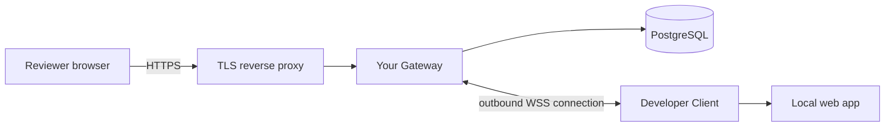

# Review Tunnel

English | [한국어](README.ko.md)

Share a web application running on your computer with authenticated reviewers through a server and domain you operate. Reviewers use their browsers; developers keep working locally and can show changes through Vite HMR or Next.js Fast Refresh.

**Status: `0.1.0` alpha.** HTTP, streaming, WebSocket, account management, and temporary sharing are implemented. Page comments, region pins, and project-specific access controls are planned. See the [validation report](docs/validation/public-https-2026-09-06.md) for what has actually been tested.

## How it works

1. An operator deploys a Gateway with PostgreSQL, DNS, and HTTPS, then issues developer and reviewer accounts.
2. A developer runs a local web app and starts the Review Tunnel Client.
3. The Client prints a temporary HTTPS URL. A reviewer opens it and signs in.
4. The reviewer interacts with the app while the developer makes changes. Feedback currently happens through your existing communication tools.
5. The developer stops the Client with `Ctrl+C` to end the share.



This repository provides self-hosted software. It does not include a hosted Gateway, a public sign-up service, or a domain supplied by the maintainers. Each operator chooses their own infrastructure. A reviewer needs only a browser and an account; developers using an existing Gateway do not need to buy a domain.

## Start sharing with an existing Gateway

Prerequisites: Node.js 24+, a checkout of this repository, a running local web app, and a `DEVELOPER` account whose initial password has been changed. Commands below run from the repository root. Keep the web app running in another terminal.

```sh
npm ci
npm run share -- http://127.0.0.1:3000 \
  --gateway wss://control.tunnel.example.com/_review-tunnel/carrier \
  --username developer1
```

Replace the Gateway hostname with the one provided by your operator and `3000` with your app's port. Enter your password at the prompt. Send the generated URL to a user with the `REVIEWER` role. Content URLs have the shape `https://<generated-id>.preview.tunnel.example.com/`.

The repository and its workspace packages are currently marked `private` in npm metadata. Use the source checkout or build the documented Docker targets; no globally installable npm command is documented for this alpha.

## Set up your own Gateway

You need a Linux server, PostgreSQL 15+, control and wildcard DNS records, TLS certificates covering both names, and a reverse proxy that supports request streaming, SSE, and WebSocket upgrades.

```text
control.tunnel.example.com             login, administration, Client connection
*.preview.tunnel.example.com           generated share URLs
canary.preview.tunnel.example.com      reserved public-path check
```

These are documentation placeholders, not working endpoints. The wildcard covers new shares without a DNS change for every URL. The control hostname must remain outside the content wildcard.

Follow the [English setup guide](docs/getting-started.en.md) or [한국어 시작 안내](docs/getting-started.md). The detailed [Linux deployment runbook (Korean)](docs/linux-deployment.md) covers runtime limits, Docker targets, secrets, backup/restore, and rollback. [.env.example](.env.example) is a configuration reference; the application does not automatically load `.env` files.

New shares remain closed until the public-path canary passes and an administrator separately approves the exact deployment ID and configuration digest.

## Features and current limits

| Available | Current boundary |
| --- | --- |
| HTTP, request/response streaming, SSE, WebSocket | One loopback HTTP origin per Client; the complete origin is shared |
| Administrator-issued accounts and host-only login cookies | `REVIEWER` access is deployment-wide; no per-project invitations or access lists |
| Temporary share URLs and authenticated reconnect | Maximum lifetime 8 hours; idle timeout 30 minutes when no streams remain; reconnect grace 2 minutes |
| Account revocation and a global kill switch | Role checks propagate periodically; session revocation permits a later fresh login unless the account is disabled or its role removed |
| PostgreSQL-backed accounts and operational state | Active tunnels live in Gateway memory and end on Gateway restart |
| Vite and Next.js browser verification | Tested versions and environments are recorded in the validation report; other combinations need verification |

Developers who also open shared URLs need the `REVIEWER` role in addition to `DEVELOPER`. Plan deployments around a single Gateway instance; PostgreSQL persistence alone does not provide shared tunnel routing across replicas.

The application on the shared origin keeps its own authorization and data behavior. Use data appropriate for reviewers. See [security boundaries and reporting](SECURITY.md).

## Development and contributions

```sh
npm ci
npm run check
```

For the full suite, including a disposable PostgreSQL database and Chrome, follow [CONTRIBUTING.md](CONTRIBUTING.md). Without `TEST_DATABASE_URL`, PostgreSQL integration tests are explicitly skipped. To verify a deployed Gateway, use the [public HTTPS testing guide](docs/public-path-testing.md).

Bug reports and pull requests should include a minimal reproduction and relevant test results. See [contribution guidelines](CONTRIBUTING.md), [security reporting](SECURITY.md), and the [changelog](CHANGELOG.md).

## Roadmap and documentation

Page comments, numbered region pins, replies, resolution state, and stable project/review revisions are **not implemented yet**. The proposed scope is in the [contextual review design (Korean)](docs/contextual-review.md).

- [Account operations (Korean)](docs/internal-account-operations.md)
- [Implementation status (Korean)](docs/poc-status.md)
- [Code review findings (Korean)](docs/code-review-2026-09-06.md)
- [Architecture plan (Korean)](docs/review-tunnel-plan.md)
- [Release procedure](docs/releasing.md)

## License

[MIT](LICENSE). Third-party dependencies remain under their respective licenses.
