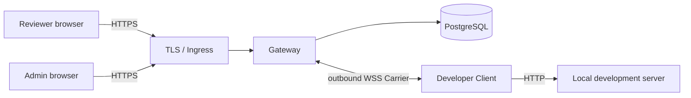

# Review Tunnel

English | [한국어](README.ko.md)

Share a local web development server with authenticated internal reviewers—without deploying the project or opening an inbound port on the developer's machine.

> [!IMPORTANT]
> Version `0.1.0` has completed the security MVP in code. DNS, TLS, Ingress, secrets, backup/restore, and operational acceptance must still be completed in each production environment.

## Quick start

Requirements: Node.js 24+, npm, and a local HTTP development server.

1. Install Review Tunnel.

```bash
git clone git@github.com:ddussi/lotur.git
cd lotur
npm ci
```

2. Run your web project. This guide assumes `http://127.0.0.1:3000`.

```bash
# Run in your web project.
npm run dev
```

3. Start the Gateway and Client in separate terminals.

```bash
# Terminal 2
npm run dev:gateway

# Terminal 3
npm run dev:client -- http://127.0.0.1:3000
```

Open the `http://<tunnel-id>.localhost:8787/` URL printed by the Client. Press `Ctrl+C` in the Client terminal to close the share.

> [!WARNING]
> Quick start has no authentication or TLS and binds to loopback. Use the authenticated deployment for real sharing.

## Features

- HTTP, streaming request/response bodies, SSE, and WebSocket relay
- Temporary subdomain URL for each share
- Built-in `ADMIN`, `DEVELOPER`, and `REVIEWER` accounts with no public sign-up
- Short-lived, single-use Carrier credentials
- Same-URL recovery during a two-minute reconnect window
- PostgreSQL-backed audit, deployment admission, and global kill switch
- Vite 8 and Next.js 16 compatibility checks

## Architecture



Review URLs use a content boundary such as `*.preview.example.com`. Login, administration, and the Carrier use a separate site boundary such as `control.example.net` so application cookies remain isolated from authentication cookies.

## Authenticated use

| Role | What the user does |
| --- | --- |
| `ADMIN` | Creates accounts and controls admission or the kill switch |
| `DEVELOPER` | Runs the Client and shares a local project |
| `REVIEWER` | Signs in and opens the generated URL |

The first administrator is created from the server-side Admin CLI:

```bash
npm run admin -- migrate
npm run admin -- bootstrap --username admin --display-name "Operations Admin"
npm run admin -- change-password --username admin
```

A developer connects to the deployed Gateway with:

```bash
GATEWAY_URL=wss://control.example.net/_review-tunnel/carrier \
CONTROL_URL=https://control.example.net \
npm run dev:client -- http://127.0.0.1:3000 --username developer1
```

The Client prompts for the password and prints the review URL after activation. A reviewer opens that URL and signs in with an account that has the `REVIEWER` role.

See [Internal account operations](docs/internal-account-operations.md) for account creation, roles, password reset, and revocation.

## Production deployment

Production requires PostgreSQL 15+, TLS-terminating Ingress, wildcard content DNS, a separate control domain, a reserved canary host, and secret management. The `Dockerfile` provides `gateway`, `admin-cli`, `client`, `canary-check`, `db-backup`, and `db-restore` targets.

New shares remain closed until the public-path canary succeeds and an administrator separately approves the exact deployment ID and configuration digest. The kill switch, canary result, and approval are stored in PostgreSQL.

Follow the [Linux deployment runbook](docs/linux-deployment.md) for environment variables, Docker commands, canary approval, backup/restore, and rollback. [.env.example](.env.example) is a reference only; the application does not automatically load `.env` files.

## Development

```bash
npm run check
npm run check:mvp
```

The PostgreSQL integration-test procedure is documented in the [deployment runbook](docs/linux-deployment.md#배포-전-자동-검증). Never use a production database as `TEST_DATABASE_URL`.

## Documentation

- [Korean README](README.ko.md)
- [Architecture plan](docs/review-tunnel-plan.md)
- [Security MVP status](docs/poc-status.md)
- [Account operations](docs/internal-account-operations.md)
- [Deployment runbook](docs/linux-deployment.md)

Detailed operational documents are currently maintained in Korean.
