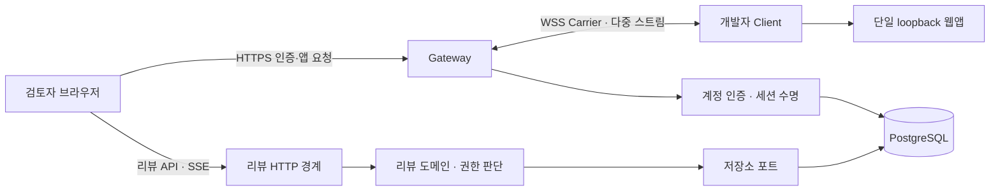

# Review Tunnel 종합 분석과 업데이트 로드맵

분석일: 2026-09-20–21 KST. 대상: `origin/main`의 `5bfb322a222ca34d31b68bb4e0eb1f3cf788e805`. 이번 작업은 분석·검증·문서화이며 제품 구현이나 배포를 변경하지 않았다.

후속 기록: 별도 수정 Goal에서 F01–F08을 구현하고 로컬 검증을 완료했다. [2026-09-21 수정 검증](../validation/reliability-fixes-2026-09-21.md)을 참고한다. 아래는 수정 전 기준 커밋에 대한 분석 기록이며 원격 배포 완료를 뜻하지 않는다.

**판단: 기반 기술은 상당히 갖춰져 있다. 다음 목표는 기능 확장보다 재현된 결함 수정, 신뢰할 수 있는 릴리스, 실제 사용 효과 입증이다.** 가장 설득력 있는 제품 방향은 “자체 운영하는 소규모 팀을 위한 로컬 웹앱 공유·화면 리뷰 도구”다. 이력에서는 네트워크 중계, 동시성·데이터 일관성, 장애 복구를 사용자 문제와 연결해 설명할 수 있다.

## 1. 분석 기준과 완료 조건

작업 시작 당시 로컬 `main`은 `ec39bc32a2fc362addbee7151365e03bf3a4707b`였다. `git fetch origin` 후 원격보다 30개 커밋 뒤임을 확인했다. `pull`·`merge`·`rebase` 없이 최신 원격을 별도 임시 디렉터리에 추출해 검토·실행했다. 따라서 아래 코드 링크는 로컬의 오래된 파일 대신 **분석한 커밋에 고정된 GitHub 링크**를 사용한다.

| 조건 | 증거와 판정 |
| --- | --- |
| 전체 저장소의 구성·검토 범위 파악 | 추적 파일 340개를 목록화하고 전송, 인증·리뷰·DB, 배포·통합, 문서·제품으로 나누어 검토. 파일별 목록은 [inventory.json](inventory.json) |
| 핵심 흐름과 불변식 파악 | 아래 구조 평가와 구체적인 코드 근거 |
| 가능한 검증 실행 | 스타일·타입·경계·빌드, Node 24 앱/DB 367개, 스크립트 79개, Chrome 22개 실행. 세부 환경·한계는 [검증 기록](validation.md) |
| 인터넷 자료와 대조 | 공식 제품 문서, 런타임 지원 정책, SRE·접근성·배포물 검증 자료를 적용성까지 평가 |
| 개선·업데이트 우선순위 결정 | 결함과 제품 제약을 구분하고 각 작업의 완료 조건·비용·선행 조건 작성 |
| 이력에 도움이 되는 방향 | 현재 주장 가능한 기술 경험과 추가 증거가 필요한 성과를 구분 |
| 최종 교차검토 | 분석 기준, 재현 결과, 우선순위, 검증 한계를 문서와 대조 |

340개 파일을 모두 같은 깊이로 정독하거나 모든 경로를 실행했다는 뜻은 아니다. 구현은 핵심 흐름·외부 경계 중심으로 읽었고, 테스트는 전체 목록을 파악한 뒤 계약·회귀 관련 본문을 선별 검토했다. 특히 긴 브라우저·문서 contract 테스트는 주요 경로 중심이다. lockfile은 의존성·감사·배포 관점에서, 생성 번들은 원본 소스와 빌드 일치 관점에서 확인했다. 이미지 3개는 시각 확인했고 영상은 촬영 코드·설명만 검토했다. 운영 서버, 전체 Git 이력의 비밀정보 감사, 모든 브라우저·OS·부하 조합은 이번 검증 범위가 아니다.

## 2. 프로젝트가 이미 잘하는 것

일반 앱 요청은 Client를 거쳐 로컬 앱으로 흐르고, 리뷰 데이터는 Gateway가 직접 저장한다. 실행 중인 터널은 메모리 수명, 프로젝트·revision·댓글은 DB 수명이다. 이 구분이 기능을 추가하거나 제거할 때 핵심 중계에 미치는 영향을 제한한다.

| 강점 | 실제 의미 | 유지할 이유 |
| --- | --- | --- |
| 명시적인 활성화·재연결 상태 | 설정 revision/digest, ACK, probe, generation을 확인한 뒤 공유 가능 상태로 전환 | 소켓 연결 성공을 서비스 준비 완료로 오인하지 않음 |
| 스트림별 흐름 제어와 자원 제한 | HTTP·SSE·WebSocket을 다루면서 큐·credit·취소·종료를 관리 | 단순 프록시 예제를 넘어 실패·부하 경계에 대한 설계 경험 |
| 계정·콘텐츠·Carrier의 인증 구분 | host별 쿠키, 일회용 자격증명, 권한 버전 재검사, kill switch | 접근 정책과 장기 연결의 수명을 함께 다룸 |
| 영속 리뷰와 임시 공유의 분리 | 동일 소유자·프로젝트·revision이면 공유가 끝나도 대화 유지 | 제품의 실질적인 사용 가치이며 별도 Carrier 확장이 필요 없음 |
| 저장소 포트와 순수 변경 정책 | 메모리/PG 구현과 변경 허용 판단을 분리 | 테스트와 데이터 경계가 이미 존재하여 전면 재설계 불필요 |
| 이벤트 일관성·초안 보존 | feed 잠금, 읽기 snapshot, 만료 cursor 복구, 제출 중 입력 보존 | 동시성 문제를 설명하고 재현할 수 있는 좋은 기술 사례 |
| 실제 소비자·복구 검증 기반 | 독립 Client 포장, Vite/Next 설치, DB migration/복원, 배포 복구 코드 | 사용자에게 전달되는 결과까지 다루는 출발점 |

근거: [프로토콜 상태](https://github.com/ddussi/lotur/blob/5bfb322a222ca34d31b68bb4e0eb1f3cf788e805/packages/protocol/src/session-state.ts), [Carrier](https://github.com/ddussi/lotur/blob/5bfb322a222ca34d31b68bb4e0eb1f3cf788e805/apps/gateway/src/gateway-carrier.ts), [권한 재검사](https://github.com/ddussi/lotur/blob/5bfb322a222ca34d31b68bb4e0eb1f3cf788e805/apps/gateway/src/authorization-revalidation.ts), [변경 정책](https://github.com/ddussi/lotur/blob/5bfb322a222ca34d31b68bb4e0eb1f3cf788e805/packages/review/src/content-mutation-policy.ts), [이벤트 트랜잭션](https://github.com/ddussi/lotur/blob/5bfb322a222ca34d31b68bb4e0eb1f3cf788e805/packages/storage-postgres/src/review-event-transaction.ts), [화면 상태](https://github.com/ddussi/lotur/blob/5bfb322a222ca34d31b68bb4e0eb1f3cf788e805/apps/gateway/src/review-ui/page-state.ts).

## 3. 현재 공개 상태와 개선 백로그

GitHub API를 실제 조회한 결과 저장소는 **public**, 게시된 Release는 **0개**, 저장소 설명·홈페이지는 미설정이었다. 소스 버전은 `0.1.0-alpha.1`이다. 소스 버전, 저장소 공개, 사용자가 설치 가능한 릴리스 완료는 다른 상태다.

최신 커밋의 [CI 실행](https://github.com/ddussi/lotur/actions/runs/34551152383)은 `verification → Run npm run check:mvp`에서 실패했다. 후속 후보·이미지 게시·운영 배포 job은 건너뛰었다. 이것만으로 현재 운영 서버의 버전을 알 수는 없다.

우선순위에서 P1은 다음 릴리스 전에 해결할 정확성·장애·검사 문제, P2는 해당 사용 조건에서 해결할 결함 또는 검증 공백이다. 즉시 운영 중단이 필요하다는 P0 판정은 이번 근거에서 도출하지 않았다. 각 항목의 재현 사실과 위험에 대한 추론을 아래에서 구분한다.

**F01 · P1 · 독립 Client 테스트의 외부 포트 의존으로 CI가 막힌다.**

- 사실: [client-package.test.mjs:57](https://github.com/ddussi/lotur/blob/5bfb322a222ca34d31b68bb4e0eb1f3cf788e805/scripts/client-package.test.mjs#L57)은 `127.0.0.1:3000`으로 Client를 실행해 `TTY is required`를 기대한다. 테스트가 해당 서버를 만들지 않는다.
- 원인: 최신 [main.ts:43](https://github.com/ddussi/lotur/blob/5bfb322a222ca34d31b68bb4e0eb1f3cf788e805/apps/client/src/main.ts#L43)은 비밀번호 입력보다 먼저 로컬 포트를 확인한다. 깨끗한 CI에서는 로컬 앱 오류가 먼저 발생한다.
- 증거: 원격 실패 로그의 실제 메시지는 “로컬 웹앱을 먼저 실행하고 주소와 포트를 확인하세요…”였다. 이번 컴퓨터에는 기존 포트 3000 리스너가 있어 같은 테스트가 통과했다. 그 서버는 변경하거나 종료하지 않았다.
- 수정 방향: 테스트가 `127.0.0.1:0` 임시 서버를 직접 만들고 할당된 포트를 사용한다. 포트 미실행 오류와 TTY 오류는 각 조건을 별도로 준비해 검증한다. 기대 오류를 아무 오류로나 느슨하게 바꾸지 않는다.
- 완료 조건: 기존 포트 3000이 열려 있거나 닫혀 있어도 결과가 같고, 깨끗한 Linux CI에서 전체 필수 job이 통과한다. 실패한 CI를 단순 재실행하는 것으로 완료하지 않는다.

**F02 · P1 · PostgreSQL에서 삭제된 댓글에 새 답글을 저장한다.**

- 사실: 같은 서비스 호출로 댓글 생성→삭제→답글 생성을 실행하면 메모리 저장소는 `STATE_CONFLICT`, PostgreSQL은 `CREATED`를 반환했다. DB에서도 `deleted_at`이 설정된 원댓글 아래 새 답글 행이 남았다.
- 원인: [createReply:337](https://github.com/ddussi/lotur/blob/5bfb322a222ca34d31b68bb4e0eb1f3cf788e805/packages/storage-postgres/src/postgres-review-repository.ts#L337)은 `undefined`와 `RESOLVED`만 거부한다. [상태 잠금 함수:981](https://github.com/ddussi/lotur/blob/5bfb322a222ca34d31b68bb4e0eb1f3cf788e805/packages/storage-postgres/src/postgres-review-repository.ts#L981)가 반환하는 `DELETED`가 통과한다.
- 영향: 삭제 후 변경 금지 계약과 저장소 간 동작이 어긋난다. 오래 열린 화면이나 직접 API 요청으로 발생할 수 있다. 전체 데이터 손실이나 권한 우회로 확대 해석하지 않는다.
- 수정 방향: 잠금을 잡은 트랜잭션 안에서 삭제 상태를 거부하고 서비스와 저장소의 허용 상태를 일치시킨다.
- 완료 조건: 메모리/PG 공통 계약 테스트에서 삭제 후 답글 실패, 답글·이벤트·알림 추가 0건. 삭제와 답글이 경합하는 실제 PG 테스트에서 잠금 획득 순서에 맞는 결과만 허용한다.

**F03 · P1 · origin 응답 헤더 한도를 넘으면 같은 Carrier의 정상 스트림도 끊긴다.**

- 사실: 정상 SSE를 열어 둔 뒤 257개 사용자 헤더를 가진 작은 응답을 요청했다. 최신 코드와 Node 24에서 해당 요청은 `503 TUNNEL_OFFLINE`, 기존 SSE는 종료, Carrier는 WebSocket `1002`로 닫혔다. 로그는 `carrier.protocol_error / header list is invalid`였다.
- 원인: [Client 응답 전송:1264](https://github.com/ddussi/lotur/blob/5bfb322a222ca34d31b68bb4e0eb1f3cf788e805/apps/client/src/client.ts#L1264)은 정리한 origin 헤더를 `encodeMetadata`로 바로 보낸다. [프로토콜](https://github.com/ddussi/lotur/blob/5bfb322a222ca34d31b68bb4e0eb1f3cf788e805/packages/protocol/src/http-metadata.ts)은 최대 256쌍을 허용하며 수신 검사 예외는 [Carrier:564](https://github.com/ddussi/lotur/blob/5bfb322a222ca34d31b68bb4e0eb1f3cf788e805/apps/gateway/src/gateway-carrier.ts#L564)에서 전체 연결 오류가 된다.
- 영향: 이 origin 응답과 관계없는 같은 터널의 HTTP·SSE·HMR 연결까지 영향을 받을 수 있다. 실제 재현한 동시 연결은 SSE이며 다른 사용자 터널 전체 장애로 주장하지 않는다.
- 수정 방향: Client가 최종 응답 메타데이터의 한도와 유효성을 전송 전에 검사하고 해당 스트림만 실패시킨다. 손상된 Carrier 프로토콜을 Gateway가 조용히 수용하도록 완화하지 않는다. 헤더를 임의로 잘라 쿠키·인증 의미를 바꾸지 않는다.
- 완료 조건: 경계 이하·초과 헤더와 메타데이터 크기 테스트, 초과 요청의 명확한 오류, 기존 SSE/WS 유지와 다음 정상 HTTP 성공, 자원 누수 없음. WebSocket upgrade 응답에도 같은 검증 경계가 적용되는지 확인한다.

**F04 · P2 · 저장된 리뷰 경로를 외부 URL로 해석할 수 있다.**

- 사실: [normalizeRoutePath:349](https://github.com/ddussi/lotur/blob/5bfb322a222ca34d31b68bb4e0eb1f3cf788e805/packages/review/src/model.ts#L349)는 역슬래시를 허용한다. 문자 그대로의 `/\example.invalid/landing`은 이 검사를 통과하며 WHATWG URL 해석 결과는 `https://example.invalid/landing`이다. [focus:340](https://github.com/ddussi/lotur/blob/5bfb322a222ca34d31b68bb4e0eb1f3cf788e805/apps/gateway/src/review-http.ts#L340)은 저장된 경로를 `location.replace`에 넘긴다.
- 조건·영향: 댓글 작성 권한이 있는 사용자가 API로 이 경로를 저장하고 다른 검토자가 해당 focus 링크를 열어야 한다. 공유 페이지 내부로 이동한다고 기대한 사용자를 외부 사이트로 보낼 수 있다. 무인증 공격, 세션 쿠키 탈취, 임의 코드 실행을 확인한 것은 아니다.
- 수정 방향: 새 경로 입력에서 역슬래시를 거부하고, 이동 직전에도 현재 origin과 일치하는 URL인지 확인한다. 이미 저장된 잘못된 경로는 댓글 본문을 삭제하지 않고 안전한 리뷰함 안내로 처리한다.
- 완료 조건: 상대 경로·한글·퍼센트 인코딩의 기존 호환성 유지, 역슬래시·authority 유사 입력 거부, 과거 데이터로 생성된 focus 응답도 외부 이동 없음. 인증된 API 생성→focus 방문의 브라우저 회귀 검사 포함.

**F05 · P2 · 필터에서 사라진 기준 댓글 때문에 전체 이력을 다시 읽는다.**

- 사실: [refreshLoadedPage:18](https://github.com/ddussi/lotur/blob/5bfb322a222ca34d31b68bb4e0eb1f3cf788e805/apps/gateway/src/review-ui/page-state.ts#L18)는 이전 목록의 가장 오래된 ID를 찾을 때까지 과거 페이지를 가져온다. [화면:606](https://github.com/ddussi/lotur/blob/5bfb322a222ca34d31b68bb4e0eb1f3cf788e805/apps/gateway/src/review-ui/view.ts#L606)은 기본 `OPEN` 필터를 이 API에 적용한다. 기준 댓글이 해결되면 필터 결과에서 사라지므로 끝까지 찾지 못한다.
- 재현: 실제 함수에 100개씩 반환하는 합성 API를 주입했다. 기존 100개 표시 상태에서 기준 댓글을 해결하고 새 댓글 하나를 추가하면, 남은 1,000개를 10번 요청해 모두 로드했다. 네트워크·브라우저 시간 측정은 아니다.
- 수정 방향: 화면에 유지할 범위를 삭제·필터 변경에도 비교할 수 있는 정렬 키로 표현하거나, 가져올 범위를 제한하고 더 보기로 연결한다. 새 항목·열린 답글·초안을 잃지 않는 정책을 먼저 정한다.
- 완료 조건: OPEN/RESOLVED/ALL과 작성자 필터, 경계 댓글의 해결·삭제·변경을 검사한다. 100/1,000/10,000개 이력에서 한 이벤트가 요청 수·렌더링을 전체 이력에 비례해 늘리지 않고, 이미 연 답글·초안은 유지한다.

**F06 · P2 · 포트를 명시한 Control origin이 배포 검사에서 거절된다.**

- 사실: 런타임의 [Control host parser:732](https://github.com/ddussi/lotur/blob/5bfb322a222ca34d31b68bb4e0eb1f3cf788e805/apps/gateway/src/config.ts#L732)는 `host:port`를 지원한다. 그러나 [배포 구성:107](https://github.com/ddussi/lotur/blob/5bfb322a222ca34d31b68bb4e0eb1f3cf788e805/scripts/deploy_gateway.py#L107)은 `CONTROL_HOST` 전체와 포트가 제외된 URL `hostname`을 비교한다.
- 재현: 기존 Python fixture에서 `CONTROL_HOST=control.example.com:8443`, `controlUrl=https://control.example.com:8443`만 일치시켜 변경해도 `Control origin does not match gateway.env`로 거절됐다. Docker·SSH·배포는 실행하지 않았다.
- 영향·수정: 비표준 HTTPS 포트를 쓰는 유효한 설치를 막는다. hostname과 실효 포트의 정규화 규칙을 정하고 런타임·배포에 같은 계약을 적용한다.
- 완료 조건: 기본 443의 생략/명시, 8443 일치, 포트·호스트 불일치를 각각 검사한다. 잘못된 origin을 허용하는 방향으로 비교를 제거하지 않는다.

**F07 · P2 · 일시적 연결 거절의 오류 메타데이터 계약이 다르다.** [Gateway:159](https://github.com/ddussi/lotur/blob/5bfb322a222ca34d31b68bb4e0eb1f3cf788e805/apps/gateway/src/gateway-carrier.ts#L159)는 `RELAY_NOT_READY`에 `retryAfterMs: 1000`을 붙이지만 [decoder:339](https://github.com/ddussi/lotur/blob/5bfb322a222ca34d31b68bb4e0eb1f3cf788e805/packages/protocol/src/session-config.ts#L339)는 `RESUME_IN_PROGRESS`에만 이 필드를 허용한다. 최신 코드의 Node 24 순수 함수 재현에서 `CONNECTION_ERROR retryAfterMs is invalid`가 발생했다. 의도한 연결 거절 이유가 디코딩 오류로 바뀌는 계약 결함이다. 허용할 코드·재시도 필드를 명시하고 송수신을 맞춘다. 모든 오류 코드의 round-trip과 실제 수용량 초과→의도한 오류·재시도 동작을 검사하면 완료다. 실제 과부하 통합 재현은 하지 않았다.

**F08 · P2 · 특수한 헤더 이름을 변환할 때 값을 잃거나 바꾼다.** [headerPairsToOutgoingHeaders:72](https://github.com/ddussi/lotur/blob/5bfb322a222ca34d31b68bb4e0eb1f3cf788e805/packages/proxy/src/header-policy.ts#L72)는 일반 객체 `{}`에서 기존 값을 찾는다. Node 24 함수 재현에서 `constructor: value`가 `[Object 생성자, "value"]`가 되고 `__proto__`는 own property로 남지 않았다. 반환 객체의 prototype이 바뀌지만 **전역 prototype 오염을 입증한 결과는 아니다**. prototype 없는 사전 등으로 헤더 이름과 기본 객체 속성을 분리한다. 일반·중복·대소문자·특수 이름의 값 보존과 실제 HTTP 왕복을 검사하면 완료다. 이번에는 함수 결과만 확인했고 HTTP 왕복 영향은 미검증이다.

**배포 검증 보강 · 다음 알파 릴리스의 필수 조건.** [CI:85](https://github.com/ddussi/lotur/blob/5bfb322a222ca34d31b68bb4e0eb1f3cf788e805/.github/workflows/ci.yml#L85)에서 만든 `:ci` 이미지는 복원까지 검사하지만, [후보 이미지 생성:94](https://github.com/ddussi/lotur/blob/5bfb322a222ca34d31b68bb4e0eb1f3cf788e805/scripts/candidate-images.mjs#L94)과 [게시 job:244](https://github.com/ddussi/lotur/blob/5bfb322a222ca34d31b68bb4e0eb1f3cf788e805/.github/workflows/ci.yml#L244)은 다시 빌드한다. 후보에는 digest·label·pull 후 동일성 확인과 시작 오류 smoke가 이미 있다. 부족한 것은 **실제 배포 digest에 기능·복원 검사 결과를 연결하는 증거**다. 현재 재빌드 결과가 실제로 달랐다고 판정한 것은 아니다.

단순한 해결은 최종 이미지 한 묶음을 만들고 그 digest로 기능·복원을 검사한 뒤 같은 digest를 승격하는 것이다. 재빌드가 필요한 구조라면 최종 digest에 같은 검사를 다시 적용한다. provenance·attestation은 소스와 산출물의 연결을 보완하지만 기능 검사를 대체하지 않는다. [GitHub artifact attestations](https://docs.github.com/en/actions/concepts/security/artifact-attestations), [SLSA provenance](https://slsa.dev/spec/v1.2/provenance).

**복구·HTTPS 검증 공백.** 현재 복원 검사와 배포 실패 시 이전 컨테이너 복귀 구현은 강점이다. 다만 신규 migration 뒤 이전 앱이 새 schema에서 계속 동작하는지와, 최신 리뷰 기능의 실제 HTTPS 전체 흐름은 별도 증거가 필요하다. migration 역실행을 무조건 추가하기보다 허용할 앱/schema 조합과 백업 복구 경로를 정하고 실제 데이터로 검증한다. 이 항목은 장애가 발생했다는 보고가 아니라 릴리스 인수 조건이다.

**현행 문서 정리.** [구현 현황:6](https://github.com/ddussi/lotur/blob/5bfb322a222ca34d31b68bb4e0eb1f3cf788e805/docs/poc-status.md#L6)은 Client·로컬 체험을 준비 중으로, 같은 문서의 제한과 [알파 릴리스 안내:22](https://github.com/ddussi/lotur/blob/5bfb322a222ca34d31b68bb4e0eb1f3cf788e805/docs/releases/0.1.0-alpha.1.md#L22)는 초안을 메모리 전용으로 설명한다. 최신 코드에는 독립 Client, 데모, sessionStorage 기반 새로고침 복구가 있다. 현재 사용 안내는 갱신하고 과거 계획·검증 기록은 날짜와 SHA가 붙은 기록으로 보존한다. README·지원 표·구현 현황이 같은 사실을 설명하면 완료다.

| 실행 순서 | 항목 | 비용 추정 | 핵심 확인 |
| --- | --- | --- | --- |
| 1 | F01 CI fixture 독립성 | 반나절 | 깨끗한 환경에서도 같은 오류 경로 검사 |
| 2 | F02 삭제 상태, F03 전송 격리 | 각 0.5–1.5일 | 실제 PG 계약과 같은 터널의 다른 스트림 유지 |
| 3 | F04 안전한 경로 이동 | 0.5–1일 | 새 입력과 기존 저장 데이터 모두 확인 |
| 4 | F05 조회 범위, F06 포트 계약 | 합계 1–2일 | 데이터 크기·필터·origin 경계 검사 |
| 4 | F07 오류 메타데이터, F08 헤더 사전 | 합계 0.5–1일 | 순수 함수 반례와 실제 연결·HTTP 왕복 회귀 |
| 5 | 배포 digest·복구·HTTPS 증거 | 2–4일 | 최종 산출물과 실제 외부 경로의 인수 |
| 6 | 현행 문서·알파 릴리스 안내 | 0.5–1일 | 구현·지원·설치 안내의 일치 |

비용은 이해·수정·회귀 검사를 포함한 범위 추정이며 합산 상한을 일정으로 확약하지 않는다. F01로 CI를 먼저 복구한 뒤 독립 항목은 병행할 수 있다. 이번 분석에서 구현한 수정은 없다.

## 4. 유지보수와 제품 경계에 대한 판단

**현재 구조를 유지하면서 실제 변경 이유에 맞춰 작게 정리하는 편이 낫다.** 단일 Gateway와 PostgreSQL, Node/TypeScript, 모듈 경계를 버리고 마이크로서비스·새 프레임워크로 옮길 근거는 발견하지 못했다.

| 영역 | 판단과 다음 행동 | 완료 조건 |
| --- | --- | --- |
| Client의 큰 조합 파일 | `client.ts` 1,568줄은 재연결·로컬 요청·전송 상태가 함께 있어 수정 영향 파악이 어렵다. 다음 전송 수정 때 소켓·타이머 소유권 기준으로 분리 | 기존 공개 API·취소·재연결 테스트 유지, 자원마다 생성/종료 주체가 하나 |
| 리뷰함의 문자열 JavaScript | `review-control-view.ts`가 큰 문자열로 브라우저 로직을 담는다. 기존 typed UI 빌드에 진입점을 합류시킬 가치가 있다 | `/reviews/app.js` URL·CSP·초안 동작 유지, 브라우저 코드가 타입 검사 대상 |
| 공용화 | 순수 정책은 공유하되 Gateway와 Client의 모양이 비슷한 큐를 무조건 하나로 합치지 않는다 | 동일한 불변식만 추출, 호출만 전달하는 계층·추상 factory를 추가하지 않음 |
| DB 이벤트 잠금 | revision/path별 잠금은 커밋 순서를 지키기 위한 의도된 비용 | 최적화 전 lock 대기·p95·동시 writer 측정, 이벤트 누락 회귀 유지 |
| 화면 갱신 | 오버레이 SSE와 리뷰함 polling은 작은 팀에서 단순한 선택이다 | 실제 조회 수·전송량·반영 지연을 먼저 측정, 변경 대상 재조회/가시성·backoff를 단계적으로 적용 |
| 프로젝트 권한 | 현재 역할은 배포 전체에 적용된다. 서로 신뢰하는 단일 팀의 명시적 제약이며 그 자체를 인증 우회 버그로 분류하지 않는다 | 외부 팀·비공개 프로젝트 수용 전에 Content·Control·SSE·알림·활성 링크까지 동일 membership 정책 적용 |
| 재시작·다중 Gateway | Gateway 재시작 시 URL 종료는 현재 승인된 제품 제약 | 지속 URL·무중단 수요가 확인될 때 route 소유권·resume affinity·공유 한도를 설계 |
| UI·접근성 | 기존 캡처에서 한국어/영어 혼용, 상태·영구 링크 밀착, 높은 패널 정보 밀도가 보인다 | 언어·상태 계층을 일관되게 정리하고 키보드·포커스 복귀·모바일·확대·한국어 IME를 실제 검사 |

인증 강화의 작은 후속 항목은 [비밀번호 정책](https://github.com/ddussi/lotur/blob/5bfb322a222ca34d31b68bb4e0eb1f3cf788e805/packages/auth/src/password-policy.ts)의 네 항목짜리 차단 목록이다. 최소 길이·로그인 제한과 별개로 흔하거나 유출된 비밀번호 목록의 출처·갱신·크기 정책을 정할 수 있다. [NIST SP 800-63B-4](https://pages.nist.gov/800-63-4/sp800-63b.html)는 이런 목록과 대조하는 방식을 설명한다. 이 프로젝트의 NIST 준수 의무나 인증 전체의 규정 위반을 주장하는 것은 아니다. 도입한다면 비밀번호를 외부 서비스로 원문 전송하지 않고, 신규 설정·변경에 대한 일관된 검사와 갱신 실패 정책을 완료 조건으로 둔다.

또한 [리뷰 설계:298](https://github.com/ddussi/lotur/blob/5bfb322a222ca34d31b68bb4e0eb1f3cf788e805/docs/contextual-review.md#L298)의 답글 수·프로젝트별 생성 속도 상한은 검토한 구현에서 집행 위치를 찾지 못했다. 현재 확인한 body·페이지·SSE 한도와 구분해야 한다. 공개 범위를 넓히기 전 정책 필요성을 정하고 실제 mutation 경계에서 검증하거나, 아직 계획인 내용으로 문서를 고치는 후속 확인 항목이다. 이번에 자원 고갈을 부하 재현한 것은 아니다.

줄 수 자체를 품질 점수로 쓰지 않는다. 타입 밖 문자열 처리와 자원 수명이 얽히는 변경 위험을 줄이는 데 목적이 있다. [W3C 키보드 인터페이스 지침](https://www.w3.org/WAI/ARIA/apg/practices/keyboard-interface/)을 참고하되 현재 화면이 접근성 기준 전체를 위반한다고 단정하지 않는다. 화면 읽기 프로그램 검사는 이번에 수행하지 않았다.

## 5. 제품 방향과 경쟁 도구 비교

범용 “localhost를 URL로 공유”만으로는 차별성을 설명하기 어렵다. ngrok은 로컬 공유와 인증 정책을, Cloudflare Tunnel은 아웃바운드 연결과 운영 기능을 제공한다. Vercel은 화면 댓글뿐 아니라 로컬 환경의 Toolbar도 지원한다. 따라서 “로컬 리뷰가 가능한 유일한 도구”라는 표현은 근거가 없다. [ngrok 공유 안내](https://ngrok.com/use-cases/share-localhost), [Cloudflare Tunnel](https://developers.cloudflare.com/tunnel/), [Vercel Comments](https://vercel.com/docs/comments), [Vercel 로컬 Toolbar](https://vercel.com/docs/vercel-toolbar/in-production-and-localhost).

| 방향 | 이 프로젝트에 대한 판단 |
| --- | --- |
| 자체 서버·계정·리뷰 데이터 소유 | 현재 구조와 맞는 차별화 가설. 대신 DNS/TLS/DB 운영 비용을 사용자가 감수해야 함 |
| 배포 대기 없이 HMR 화면에서 검토 | 작은 UI 수정·대화에 적합. 개발자 PC가 꺼지면 실제 앱도 사용할 수 없음 |
| 공유가 끝나도 리뷰함 유지 | 이미 구현한 가치. 재검토를 통해 “의견 전달 → 수정 → 확인”이 끝나는 경험에 집중 |
| 글로벌 터널·고가용성 플랫폼 경쟁 | 초기 우선순위에서 제외. 필요 용량·장애 비용이 측정되기 전 투자 비용이 큼 |
| AI 자동 리뷰·스크린샷 수집 | 현재 핵심 문제 해결보다 뒤. 데이터 경계·정확도 평가·사용자 수요가 확인된 뒤 선택 기능으로 검토 |

우선 검증할 가설은 “작은 팀이 메신저+별도 Preview 공유보다 적은 설명과 대기 시간으로 UI 수정 확인을 끝낸다”다. 기존 도구보다 우수하다는 결론은 아직 내릴 수 없다. 실제 사용자 파일럿 기록이 필요하다.

## 6. 업데이트 로드맵

아래 비용은 코드에 익숙한 개발자 1명의 구현·검증을 포함한 초기 추정이다. 납기 약속이 아니며 이슈 재현·대상 환경에 따라 다시 산정한다. 우선순위는 릴리스 차단·정확성 → 사용자 체험 → 측정 → 수요가 있는 확장 순서다.

| 순서 | 작업 묶음 | 예상 비용 | 진입·완료 판단 |
| --- | --- | --- | --- |
| 1 | 재현된 결함과 검사 독립성 수정 | 4–8 작업일 | 각 반례를 실패 테스트로 먼저 고정, 최소 수정, 기존 회귀와 깨끗한 CI 통과 |
| 2 | 검증한 배포물로 알파 릴리스 준비 | 3–5 작업일 | 아래 릴리스 체크리스트 충족. 실제 게시·배포는 별도 명시적 실행 범위 |
| 3 | 작은 팀 파일럿과 최소 계측 | 계측 2–4일 + 관찰 1–2주 | 합성 예제와 실제 사용을 구분, 두 번 이상의 수정·재검토 순환 기록 |
| 4 | 파일럿의 가장 큰 방해 요인 한 묶음 해결 | 2–5 작업일 | 개선 전후 같은 과제로 측정, 사용자 입력 손실·권한 회귀 없음 |
| 5 | 프로젝트 membership | 필요 시 5–10 작업일 이상 | 외부 참여자·비공개 프로젝트가 필요한 경우 단계 3보다 선행. 기존 데이터 접근 이행 정책 필수 |
| 6 | 추가 제품 기능 | 항목별 별도 산정 | 반복 수요와 유지 비용이 확인된 항목 하나씩 선택 |

### 릴리스가 완료됐다고 판단할 조건

1. 최신 최종 SHA의 깨끗한 CI에서 필수 검증이 모두 통과하고 skip·job 누락이 없다. 수동 후보 게시나 비활성 자동배포의 정상적인 조건부 skip과 구분한다.
2. Client·Vite·Next 설치 파일의 버전·해시와 소스가 일치한다. 실제 소비자 설치를 확인한다.
3. 배포할 이미지 **digest 자체**로 런타임·복원 검증을 하고 같은 digest를 승격한다. 동일 source SHA로 다시 빌드했다는 사실만으로 동일 산출물이라고 간주하지 않는다.
4. 데이터가 있는 이전 버전 → migration → 새 버전 → 허용된 rollback 또는 백업 복원 경로를 검증한다. “이전 컨테이너 재시작”과 DB 복구를 구분한다.
5. 전용 계정의 실제 HTTPS에서 로그인·HMR·핀/댓글·리뷰함·SSE 복구·권한 회수·재검토를 검증한다. 기존 canary만으로 리뷰 전체를 통과시켰다고 쓰지 않는다.
6. 현재 구현·지원 범위·공개 상태를 README, 구현 현황, 문서 인덱스, 릴리스 안내에서 일치시킨다.
7. 공개할 정확한 버전·알려진 제한·설치 명령을 확정하고, 게시 후 비로그인 소비자가 내려받아 설치 가능한지 확인한다.

### 선택 기능은 다음 순서로 판단한다

| 후보 | 권장 진입 조건 | 핵심 완료 조건 |
| --- | --- | --- |
| 첫 사용·로그인 UX | 파일럿에서 로그인/초기 비밀번호 변경이 반복 방해 | 실패·재시도 뒤 원래 리뷰 복귀, 키보드 가능, 비밀번호 재노출 없음 |
| 버전 간 선택적 이어 보기 | revision 전환 때 미해결 피드백을 잃음 | 원본 보존·출처 링크·중복 방지, anchor 재확인. 자동 이동부터 만들지 않음 |
| 프로젝트 멤버·초대 | 서로 비공개인 프로젝트 또는 외부 검토자 | 기존 배포 전체 접근의 이행 정책, 회수 후 열린 연결·알림·검색까지 차단 |
| Markdown/JSON 내보내기 | 리뷰 결과를 문서·이력·이슈로 옮기는 작업 반복 | 접근 가능한 항목만 내보내기, 안정 ID·revision·상태 포함, 민감 데이터 선택 |
| GitHub/Slack 연동 | 내보내기로 부족한 반복 작업이 측정됨 | 기본 비활성·명시적 대상·outbox/중복 방지·재시도·발송 실패 확인 |
| 스크린샷 첨부 | 위치만으로 설명 불충분한 사례 반복 | 사용자 선택·민감정보 확인·크기/보존/삭제/접근 정책 후 추가 |
| 여러 탭·기기 초안 | 같은 탭 복구만으로 해결되지 않는 손실 사례 | 계정·프로젝트 격리, 충돌·만료·로그아웃 처리. 현재 sessionStorage 기능과 구분 |
| 다중 Gateway | 단일 인스턴스 용량·중단 비용이 실제 한계 | 공유 registry만 추가하지 말고 route 소유권·재연결·분산 제한·장애 모형 검증 |

## 7. 의존성 업데이트 판단

2026-09-20–21에 확인한 공식 지원 정책 기준이다. 최신 버전이 있다는 사실만으로 현재 버전이 취약하다고 판정하지 않는다.

| 구성 | 현재 원격 | 판단·다음 확인 |
| --- | --- | --- |
| Node | engines `>=24`, CI 24 | 24 LTS 유지. 개발/CI/이미지/하위 프로세스 버전을 명시. 이번 26.0.0 테스트 실패 때문에 `>=24` 전체가 검증됐다고 말할 수 없음 |
| Next.js | 16.3.3 | 16 Active LTS. 후속 patch는 Server Actions·RSC·Fast Refresh·production bootstrap 제외 검사와 함께 갱신 |
| Vite | 8.2.2 | 8.2는 중요 수정·보안 backport 대상, 8.3은 일반 patch 대상. 8.3 전환은 HMR·CSP·포장된 integration으로 검증 |
| PostgreSQL | 17.11 이미지 digest 고정 | 공식 17 계열 현재 minor와 일치. major 18 전환은 기능 수요·업그레이드 검증 없이 우선 과제로 삼지 않음 |
| 나머지 운영 의존성 | `argon2`, `pg`, `ws` 및 lockfile | 설치 감사와 `npm audit --omit=dev` 0건. 감사 범위 밖 이미지/OS·로직 결함까지 안전하다는 뜻은 아님 |

공식 근거: [Node 릴리스 정책](https://nodejs.org/en/about/previous-releases), [Next 지원 정책](https://nextjs.org/support-policy), [Vite 지원 버전](https://vite.dev/releases), [PostgreSQL versioning](https://www.postgresql.org/support/versioning/).

업데이트는 작은 의존성 묶음으로 분리하고 changelog→소비자 호환 검사→복원 가능한 배포물 순서로 진행한다. dependency bot을 도입하더라도 자동 merge·배포를 기본값으로 추가할 필요는 없다. Node/Chrome/프레임워크의 “설치 가능 범위”와 “검증한 지원 조합”을 별도 표로 관리한다.

## 8. 이력·포트폴리오에 도움이 되는 방향

직무 선호 응답이 없어 프로젝트의 실제 강점에 따라 **백엔드·플랫폼 역량을 중심으로, 풀스택 제품 완성 경험을 함께 보여 주는 방향**을 가정했다. 채용 시장의 선호를 조사한 결론이 아니라 코드와 검증 근거에 따른 제안이다. 본인의 실제 기여 범위는 커밋·설계 기록으로 별도 확인해 표현해야 한다.

| 대표 사례 | 설명할 문제와 판단 | 남길 증거 |
| --- | --- | --- |
| 전송 장애 격리 | 하나의 잘못된 origin 응답이 왜 전체 터널을 끊었는지, stream 오류와 protocol 오류를 어디서 구분했는지 | 최소 재현·수정 전후 테스트, 동시 HTTP/SSE/WS 유지 결과 |
| 데이터 일관성 | sequence ID와 commit 순서 차이, 상태 잠금, tombstone, 메모리/PG 계약 불일치 | 실제 PostgreSQL 경합 테스트, 상태 전이표, SQL/lock 비용 측정 |
| 사용자 입력 보존 | SSE·필터·늦은 응답·저장 중 타이핑에서 초안을 지키는 방법 | 두 브라우저 회귀 영상, 실패 주입 결과, 상태 소유권 설명 |
| 배포·복구 | 코드가 같아도 재빌드한 이미지가 같은 결과라는 보장은 없다는 점 | 검증 digest→승격 digest, 복원 drill, 이전/새 앱과 schema 조합 |
| 제품 효과 | 누구의 어떤 검토 단계를 줄였는지 | 익명 파일럿, 설치/첫 댓글/수정확인 시간, 실패·포기 이유 |

현재 쓸 수 있는 설명 예시:

> 자체 운영형 웹앱 리뷰 도구에서 TypeScript/Node 기반 HTTP·SSE·WebSocket 중계와 PostgreSQL 영속 리뷰를 구성했다. 세션 활성화·재연결, 권한 회수, 데이터 동시 변경과 브라우저 초안 보존을 자동 검사로 검증했다.

위 문장은 본인이 해당 구현에 기여한 범위에 맞게 좁혀 사용한다. “대규모 트래픽 처리”, “무중단 배포”, “프로젝트별 권한 격리”, “리뷰 시간 N% 절감”은 현재 증거 없이 쓰면 안 된다. 로컬 468개 검사 결과도 환경과 외부 포트 의존을 함께 밝혀야 한다.

앞으로 성과로 바꿀 문장 틀:

> [동일 과제·참여자 수·측정 기간]에서 [기존 방식]과 비교해 첫 리뷰 완료 시간을 [측정값]에서 [측정값]으로 줄였다. [실패 시나리오]에서도 [관찰한 불변식]을 유지했고, [제약]은 남아 있다.

빈칸은 실제 측정 후 채운다. 소규모 표본이면 평균만 제시하지 말고 개별 결과·중앙값·범위·표본 수를 공개한다. 과거 문서의 DB 목록 p95 19.9ms는 당시 로컬 SQL 측정이며 현재 제품의 사용자 체감 지연으로 재사용하지 않는다.

### 파일럿에서 최소한 측정할 항목

- 시작 성공: 준비된 환경에서 공유 시도 수 대비 실제 사용 가능한 URL 수. 사용자 취소와 서버 오류를 분리.
- 첫 체험: 설치 시작→첫 공유→검토자의 첫 댓글까지 걸린 시간과 도움 요청 횟수.
- 정확성: 저장 요청 중 초안 손실·중복 댓글·잘못된 상태 전이·허가되지 않은 접근 건수.
- 리뷰 반영: mutation 성공→다른 브라우저 표시 지연. 로컬 앱 직접 접근과 터널의 추가 TTFB/HMR 지연을 분리.
- 자원: 동시 터널/stream/브라우저 수별 RSS·큐 크기·event-loop 지연·DB pool/lock 대기.
- 제품 효과: 한 과제의 의견 전달→수정→재검토 완료 시간, 설명을 되묻는 횟수, 버려진 핀·미해결 항목.

현재 [메트릭 구현](https://github.com/ddussi/lotur/blob/5bfb322a222ca34d31b68bb4e0eb1f3cf788e805/apps/gateway/src/metrics.ts)은 주로 이벤트 counter와 상태 gauge다. 사용자 체감 지연·flow-control 대기·복구 시간은 추가 계측이 필요하다. 처음부터 큰 관측 플랫폼을 만들기보다 저카디널리티 histogram과 반복 가능한 실험으로 시작한다. 목표 수치는 기준값·사용자 허용 지연을 확인한 뒤 정한다. [Google SRE의 SLO 수립 지침](https://sre.google/workbook/implementing-slos/)도 핵심 사용자 흐름과 측정 정의를 먼저 정하는 접근을 설명한다.

포트폴리오는 README 하나에 모든 과거 계획을 넣기보다 ① 60–90초 실제 시연 ② 구조 그림과 핵심 제약 ③ 재현·개선 사례 두 편 ④ 측정 보고서 ⑤ 설치 가능한 릴리스로 연결하는 편이 좋다. 시연은 이미 있으므로 사용자 문제와 복구 장면을 보강하고, 저장소 설명·About 링크·현재 CI 상태를 정리한다.

## 9. 이번 분석의 한계와 후속 실행 범위

이번 문서는 구현할 순서를 결정하는 분석 결과다. 지적한 버그 수정, 프로젝트 ACL, 새 릴리스·태그, 운영 배포, 외부 알림 발송을 수행하지 않았다. 로컬 `main`과 사용자 파일은 유지했고 분석 문서만 추가했다.

운영 HTTPS·장기 부하·실사용 효과, PG 17.11의 이번 실행, 여섯 Docker 런타임의 이번 재빌드·복원은 미검증이다. 과거 CI/복원 기록은 기존 기반의 근거로 읽었지만 최신 커밋의 통과 근거로 대신 사용하지 않았다. 검증의 자세한 성공·실패·환경 차이는 [검증 기록](validation.md)에 남겼다.
