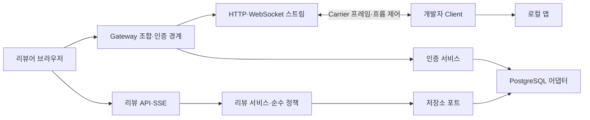

# Review Tunnel 아키텍처 리뷰와 개선 결과

검토 기준은 `e41541c`, 결과는 현재 작업 트리다. 검토·구현·검증 일자는 2026-09-07이다. 이번 목표는 핵심 정확성 문제를 회귀 테스트로 고정하고, 기존 동작을 보존하면서 변경 경계를 만드는 것이었다. 커밋·push·운영 배포는 포함하지 않았다.

**판단:** 프로토콜 상태 머신, 전송량 제한, 인증 버전 검증, 저장소 포트라는 기반은 유지할 가치가 있다. 가장 시급했던 문제는 기능 부족보다 요청 간 장애 전파, 최초 접근과 재검사의 정책 불일치, DB 커서와 커밋 순서의 불일치, 브라우저 서버 데이터와 작성 상태의 혼합이었다. 이를 수정하고 Gateway와 리뷰 화면의 책임을 분리했다. 운영 HTTPS와 장기 부하까지 검증한 결과로 해석해서는 안 된다.

## 1. 핵심 흐름과 의존 관계

브라우저에서 보는 로컬 앱 요청과 리뷰 데이터 요청은 목적지가 다르다. 일반 요청은 Carrier를 거쳐 개발자 PC로 전달한다. 댓글·답글·알림·리뷰 SSE는 Gateway가 직접 처리하고 저장소에 접근한다. 리뷰 기능을 끈 기본 중계에는 리뷰 저장소가 필요하지 않다.

### 연결 생성과 복구

1. Client가 개발자 자격으로 Carrier 연결을 연다. Gateway는 수용량과 자격 증명의 용도·터널 일치를 검사한다.
2. HELLO 이후 세션 설정을 교환하고 설정 확인 및 로컬 경로 probe를 통과해야 ACTIVE가 된다. 생성 중인 터널을 곧바로 공유 가능한 터널로 취급하지 않는다.
3. 요청마다 별도 stream ID를 부여한다. 연결·스트림 credit, 대기 바이트와 프레임 수, 요청 및 세션 제한으로 메모리 사용을 제어한다.
4. Carrier가 끊어지면 기존 요청들을 종료하고 제한된 시간 동안 재연결을 허용한다. transport epoch로 소켓·generation·흐름 제어 인스턴스를 묶어, 이전 연결의 비동기 결과가 새 연결을 정리하지 못하게 한다.
5. 중지·만료·권한 회수 시 세션 소유자가 스트림, 타이머, 바인딩을 정리한다. 서버 종료는 대기 중인 바인딩 정리도 기다린다.

### 인증과 리뷰 변경

공유 콘텐츠 접근 조건은 배포 전체의 `DEVELOPER 또는 REVIEWER`다. `ADMIN`만 있는 계정에는 공유 접근을 주지 않는다. 터널 소유자의 개발자 권한 검사는 별도다. 계정 활성 상태, 비밀번호 변경 요구, 인증 버전을 기존대로 확인한다.

리뷰는 임시 tunnel/session 바인딩을 안정적인 project/revision에 연결한다. 경로는 정규화된 pathname을 사용한다. 서비스는 입력과 기능 권한을 검증하고 저장소 포트를 호출한다. PostgreSQL 어댑터는 실제 계정·바인딩·댓글 상태를 잠금 안에서 재확인한다. 수정·삭제는 작성자, 스레드 상태, 삭제 여부, expectedVersion을 검사하며 삭제 흔적을 남겨 답글·pin과의 관계를 보존한다.

## 2. 재현한 문제와 조치

P1은 공유 기능이나 여러 요청에 영향을 주는 문제, P2는 데이터 전달·화면 정확성 문제를 뜻한다. 아래 항목은 이번 작업에서 수정했다.

| 우선순위 | 재현 조건과 기존 영향 | 변경 및 근거 |
| --- | --- | --- |
| P1 | 공통 프로토콜 한도를 넘는 헤더를 Gateway가 Carrier로 보내면 Client의 디코딩 실패가 터널의 다른 요청까지 끊을 수 있었다. | HTTP·WebSocket 모두 stream 생성 전에 공통 OPEN 메타데이터 인코더로 검증한다. 잘못된 요청은 400/431로 거부하고, 이미 열린 SSE·WebSocket 및 후속 HTTP가 살아 있는지 검사했다. |
| P1 | DEVELOPER 계정은 최초 접근이 허용되지만 장시간 연결의 재검사는 REVIEWER만 요구했다. 정상 연결이 주기적으로 종료됐다. | `SHARED_CONTENT` 접근 조건을 최초 접근과 재검사에 공유한다. 역할 조합별 SSE·WebSocket 유지, 계정 비활성화·실제 역할 회수 후 종료를 검사했다. |
| P2 | PostgreSQL sequence 값은 커밋 순서가 아니다. 먼저 작은 ID를 받은 트랜잭션이 지연되면 나중 ID가 먼저 전달돼 작은 ID가 영구 누락될 수 있었다. | revision·경로별 transaction advisory lock을 이벤트 생성 트랜잭션 시작에 잡고 커밋까지 유지한다. 첫 INSERT 후 대기 중인 writer, 두 번째 writer, 별도 경로 writer를 제어해 커서 추월 방지와 별도 경로 진행을 검증했다. |
| P2 | 최초 목록과 cursor를 다른 스냅샷으로 읽으면 아직 화면에 없는 변경까지 읽었다고 기록할 수 있었다. 보관 범위를 지난 커서도 조용히 진행했다. | 목록·답글·집계·cursor를 한 `REPEATABLE READ READ ONLY` 트랜잭션으로 읽는다. 삭제된 이벤트의 feed별 최댓값을 저장하고 `REVIEW_CURSOR_EXPIRED`를 전달한다. 화면은 목록을 다시 읽고 구독을 재개한다. |
| P2 | 최신 100개만 다시 읽어 기존 캐시에 합치면 이미 로딩한 이전 댓글·답글의 수정·삭제·해결 상태가 오래된 값으로 남았다. | 사용자가 로딩한 가장 오래된 ID까지 댓글과 답글 범위를 다시 읽는다. 각각 101개 이상을 만든 브라우저 테스트에서 이전 항목의 수정·삭제·resolve/reopen을 확인했다. |
| P2 | 실시간 갱신 때 댓글 DOM 전체를 교체해 답글 초안과 포커스가 사라졌다. 제출 완료 후 무조건 입력을 비우면 대기 중 새로 쓴 글도 사라졌다. | thread ID로 행과 reply form을 유지한다. 경로·thread별 초안 버전을 기록하고 제출 당시 버전과 같은 경우에만 비운다. 새 댓글에도 같은 정책을 적용했다. peer 이벤트, 페이지 로딩, 저장·조회 실패, 제출 중 입력, 경로 이동을 검사했다. |
| P2 | 이전 답글 조회 응답이 늦게 도착하면 그 사이 도착한 최신 실시간 스냅샷을 덮어썼다. | 조회 시작 때의 화면 데이터 세대를 확인하고 오래된 응답은 적용하지 않는다. 브라우저에서 응답을 붙잡은 사이 답글을 수정해 재현했으며, 최신 수정 유지와 재시도 로딩을 검사했다. |

코드 근거:

- 요청 격리: [gateway-streams.ts](/Users/imaruhan/Desktop/project/lotur/apps/gateway/src/gateway-streams.ts), [http-metadata.ts](/Users/imaruhan/Desktop/project/lotur/packages/protocol/src/http-metadata.ts), [request-isolation.test.ts](/Users/imaruhan/Desktop/project/lotur/apps/gateway/src/request-isolation.test.ts)
- 접근 정책: [auth/model.ts](/Users/imaruhan/Desktop/project/lotur/packages/auth/src/model.ts), [authorization-revalidation.ts](/Users/imaruhan/Desktop/project/lotur/apps/gateway/src/authorization-revalidation.ts), [content-revalidation.test.ts](/Users/imaruhan/Desktop/project/lotur/apps/gateway/src/content-revalidation.test.ts)
- DB 일관성: [review-event-transaction.ts](/Users/imaruhan/Desktop/project/lotur/packages/storage-postgres/src/review-event-transaction.ts), [postgres-review-repository.ts](/Users/imaruhan/Desktop/project/lotur/packages/storage-postgres/src/postgres-review-repository.ts), [PostgreSQL 통합 테스트](/Users/imaruhan/Desktop/project/lotur/packages/storage-postgres/src/postgres-review-repository.integration.test.ts)
- 화면 상태: [page-state.ts](/Users/imaruhan/Desktop/project/lotur/apps/gateway/src/review-ui/page-state.ts), [drafts.ts](/Users/imaruhan/Desktop/project/lotur/apps/gateway/src/review-ui/drafts.ts), [view.ts](/Users/imaruhan/Desktop/project/lotur/apps/gateway/src/review-ui/view.ts), [브라우저 회귀 테스트](/Users/imaruhan/Desktop/project/lotur/tests/review/review-overlay.spec.mjs)

## 3. 개선 후 아키텍처

### Gateway: 자원을 가진 모듈이 정리까지 담당한다

| 모듈 | 소유하는 책임·상태 | 정리·경계 |
| --- | --- | --- |
| [server.ts](/Users/imaruhan/Desktop/project/lotur/apps/gateway/src/server.ts) | 옵션, HTTP/Upgrade 라우팅, 인증·리뷰·전송 모듈 조합 | 모듈 종료 함수와 서버 소켓 종료를 호출한다. 기존 `createGatewayServer` 사용법을 유지한다. |
| [gateway-session-lifecycle.ts](/Users/imaruhan/Desktop/project/lotur/apps/gateway/src/gateway-session-lifecycle.ts) | 세션 등록부, 종료 전이, 스트림 일괄 정리, 대기 중인 disposal | 외부에는 ReadonlyMap을 제공한다. 등록·삭제·종료는 소유자 함수를 거친다. 리뷰 정리는 선택적 callback으로 연결한다. |
| [gateway-session.ts](/Users/imaruhan/Desktop/project/lotur/apps/gateway/src/gateway-session.ts) | 세션·스트림·transport epoch의 형태와 동일성 검사 | 예전 소켓에서 시작한 작업이 현재 연결에 적용되지 않게 한다. |
| [gateway-carrier.ts](/Users/imaruhan/Desktop/project/lotur/apps/gateway/src/gateway-carrier.ts) | 한 Carrier의 수신 큐, HELLO·설정·probe·재연결·프로토콜 처리 | 세션 등록부를 직접 소유하지 않는다. 접속 admission과 세션 수명 함수를 명시적으로 받는다. |
| [gateway-streams.ts](/Users/imaruhan/Desktop/project/lotur/apps/gateway/src/gateway-streams.ts) | 개별 HTTP·WebSocket 중계, 양방향 대기열·credit·종료 | 프로토콜과 전송 불변식을 공통 사용한다. 내부 보조 함수는 외부 API로 노출하지 않는다. |
| [gateway-admission.ts](/Users/imaruhan/Desktop/project/lotur/apps/gateway/src/gateway-admission.ts) | credential 예약, 생성 대기 수, 인증 작업 수, rate limit | 종료 시 예약을 지운다. 취소·timeout과 실제 비동기 작업 완료를 구분하는 기존 admission 보장을 유지한다. |
| [gateway-operations.ts](/Users/imaruhan/Desktop/project/lotur/apps/gateway/src/gateway-operations.ts) | kill switch, heartbeat·세션 만료·인증 artifact 정리 타이머 | `close()`가 타이머를 해제한다. 운영 정책은 입력 옵션으로 받는다. |
| [authorization-revalidation.ts](/Users/imaruhan/Desktop/project/lotur/apps/gateway/src/authorization-revalidation.ts) | 열린 연결 권한 재검사, 동시 실행 한도 | 중단 함수를 반환한다. 배치·대체 조회 모두 같은 접근 조건과 transport 동일성 검사를 사용한다. |

Gateway 진입 파일은 기존 3천 줄 이상의 직접 처리 코드에서 약 900줄의 조합·라우팅 코드로 줄었다. 단순히 파일을 잘게 나누는 것보다 Map, 예약, 타이머, 소켓의 소유자를 설명할 수 있게 된 점이 핵심이다. Carrier와 스트림 모듈은 여전히 크지만, 서로 다른 수명과 프로토콜 상태를 억지로 하나의 범용 서비스에 합치지 않았다.

### 리뷰 판단: 순수 정책과 저장소 효과의 분리

[content-mutation-policy.ts](/Users/imaruhan/Desktop/project/lotur/packages/review/src/content-mutation-policy.ts)는 읽기·쓰기 없이 현재 값으로 `ALLOWED`, `FORBIDDEN`, `STATE_CONFLICT`, `VERSION_CONFLICT`를 판단한다. 메모리 저장소와 PostgreSQL 저장소가 같은 함수를 사용한다. PostgreSQL에서는 DB 상태를 읽고 잠근 뒤 이 판단을 호출하므로, 순수 함수 추출이 동시성 보장을 약화시키지 않는다.

작성자 권한 → 삭제·해결 상태 → 버전 충돌이라는 기존 결과 우선순위를 유지한다. 관리 권한이 있다고 다른 사람의 내용을 수정할 수 있게 바꾸지 않았다. 삭제와 수정의 허용 조건도 구분했다.

### 브라우저: 서버 데이터와 작성 상태의 분리

| 모듈 | 역할 |
| --- | --- |
| `review-ui/contracts.ts` + `review-contract.ts` | 서버가 내보내는 DTO와 브라우저 타입의 연결 |
| `review-ui/api.ts` | fetch·API 오류 경계 |
| `review-ui/page-state.ts` | 로딩한 범위 재검증, 페이지 합성, 겹친 갱신 요청 병합 |
| `review-ui/drafts.ts` | 경로·thread별 작성 상태, 제출 버전 확인 |
| `review-ui/live-updates.ts` | EventSource 수명, 만료 커서 재동기화, SPA 이동 감지 |
| `review-ui/view.ts` | DOM 렌더링, 선택 영역·pin, 사용자 동작 연결, 생명주기 조합 |

입력 폼을 서버 데이터와 함께 파괴하지 않는다. 화면이 제거되면 AbortSignal을 통해 전역 이벤트·구독·초안·observer를 정리한다. API 조회 실패는 화면에 표시하고 성공한 것처럼 덮지 않는다.

큰 문자열에 JavaScript를 직접 작성하던 bootstrap은 실제 TypeScript 모듈로 바꿨다. [build-review-ui.mjs](/Users/imaruhan/Desktop/project/lotur/scripts/build-review-ui.mjs)가 기존 bootstrap URL에서 제공할 단일 IIFE 문자열을 생성한다. 생성 파일은 직접 수정하지 않으며 소스와 생성물의 불일치를 스크립트 테스트가 잡는다. 운영 실행에는 Vite가 필요하지 않다.

## 4. 호환성과 적용 시 고려할 점

- Carrier 프레임 규격, Client 연결 API, 인증 토큰·쿠키, 기존 bootstrap URL을 유지한다. Vite·Next 연동도 기존 사용법을 유지한다.
- 기존 이벤트 조회에서 cursor를 지정하지 않으면 보관 중인 이력을 조회하는 동작을 유지한다. cursor를 명시한 재연결 요청은 연속성 검사를 받는다. SSE는 브라우저가 읽을 수 있는 `review-error` 이벤트로 만료를 알린다.
- DB migration 18은 이벤트 보관 하한 테이블을 추가한다. 구버전에서 삭제된 이벤트의 이력은 복원할 수 없으므로 최초 업그레이드에서 기존 feed의 오래된 cursor를 새 스냅샷으로 이동시킨다. 댓글·답글·알림·보관 중인 이벤트를 삭제하지 않는다. 재실행은 같은 초기화를 반복하지 않는다.
- 이벤트 잠금은 revision·경로 단위다. 같은 화면에서 변경이 몰리면 쓰기 대기 시간이 늘 수 있다. 정확한 전달을 위한 비용이며, 처리량을 측정했다고 주장하지 않는다.
- 현재 화면 갱신은 사용자가 이미 펼친 범위를 다시 읽는다. 기존 API를 유지하면서 정확성을 확보하는 방식이다. 많이 펼칠수록 네트워크·DB 비용이 증가한다. 다음 최적화는 측정 후 대상 thread 재조회 또는 이벤트별 무효화로 진행하는 편이 타당하다.
- 브라우저 초안은 현재 탭 메모리에 보존한다. 탭 종료·새로고침·다른 기기까지 영속 보존하는 기능은 아니다.
- 배포 전체 공유 권한과 단일 Gateway라는 제품 경계를 유지한다. 프로젝트별 ACL이나 여러 Gateway 사이의 터널 라우팅을 구현한 변경은 아니다.

## 5. 이상적인 다음 개선 순서와 완료 판단

이번 목표의 완료와 별개인 후속 제안이다. 측정·제품 필요가 생기기 전에 새 인터페이스나 범용 파이프라인을 만들 필요는 없다.

| 순서 | 개선 방향 | 시작 조건 | 완료조건 |
| --- | --- | --- | --- |
| 1 | Client의 재연결 orchestration, 로컬 요청 실행, 스트림 전송 수명을 분리 | Client 기능을 다음으로 변경할 때 | 기존 공개 API 및 HTTP·SSE·WS·취소·재연결 테스트 통과. 각 socket·timer·queue의 생성/종료 주체가 하나이며 동작 변경이 없을 것. |
| 2 | 브라우저 갱신 비용 측정 후 필요한 thread만 재조회 | 펼친 항목 증가로 지연·쿼리 비용이 관측될 때 | 100/1,000/10,000개 데이터 시나리오의 요청 수·전송량·갱신 지연을 기록. 이전 페이지·tombstone·만료 cursor·초안·늦은 응답 회귀 테스트를 유지하면서 측정값이 개선될 것. |
| 3 | 영역 pin과 알림 렌더링을 독립 모듈로 추출 | 해당 기능을 교체·제거할 요구가 생길 때 | pin을 제거해도 댓글·답글 저장 흐름을 고칠 필요가 없고, 알림을 끄더라도 공통 페이지·초안 정책이 그대로 동작할 것. |
| 4 | 실제 운영 환경 인수 | 승인된 배포 대상과 점검 창이 있을 때 | 실제 HTTPS·쿠키·CSP·proxy buffering·WS/SSE·권한 회수·재시작 복구를 기록. 배포 ID에 대응한 canary와 admission 승인, rollback 절차 검증까지 수행할 것. |
| 5 | 이벤트 보관 정리와 같은 feed 쓰기 비용 최적화 | 부하 검사에서 병목이 확인될 때 | 데이터량·동시 쓰기 수별 lock 대기·p95 지연·DB 비용을 측정. 커밋 추월·snapshot·retention floor 테스트가 유지되는 대안만 채택할 것. |

수치 목표는 운영 SLO와 실제 측정값을 얻은 뒤 정해야 한다. 측정 없이 임의의 성능 수치를 완료조건으로 제시하지 않는다. 프로젝트 ACL이나 다중 Gateway는 별도 제품 요구가 확정되면 독립 설계로 다룬다.

## 6. 완료조건별 검증

세부 체크리스트는 [개선 목표](/Users/imaruhan/Desktop/project/lotur/docs/improvement-goal-2026-09-07.md)에 있다.

| 조건 | 확인한 근거 |
| --- | --- |
| G1 요청 격리 | 메타데이터 255/256/257 경계, 잘못된 path·헤더; HTTP/WS 오류 뒤 기존 SSE/WS와 후속 요청 유지 |
| G2 접근 정책 | 역할 조합별 장시간 연결, disable·실제 역할 회수; authVersion·비밀번호 변경 요구 및 transport epoch 회귀 |
| G3 이벤트 일관성 | 실제 PG writer 경합·재연결, 독립 feed 진행, snapshot, 보관 개수·기간 초과, 완전히 비워진 feed, 구버전 migration, 브라우저 cursor 복구 |
| G4 화면 상태 | 타입 검사·단일 번들 일치, 각각 101개 이상, 수정·삭제·상태 변경, peer 이벤트와 실패 중 초안·포커스, 제출 버전, 경로별 초안, 늦은 답글 응답 |
| G5 책임 분리 | Gateway 기존 회귀 테스트, 재연결 epoch 및 종료·admission 검사, 두 저장소가 공유하는 순수 변경 정책 테스트 |
| G6 구조 보호 | proxy·operations 의존 제한, 순수 정책 허용 의존 목록 및 위반 fixture, review-disabled 기본 중계 |
| G7 호환성 | 전체 인증·리뷰·Carrier·Client 테스트, 기존 DB 데이터 및 반복 migration, Vite HMR·Next RSC/Server Actions/Fast Refresh·production bootstrap 제외 |
| G8 최종 검사 | 아래 실행 결과에 기록 |
| G9 보고 | 본 문서의 변경 근거·후속 개선·제한 및 하단 고2 설명 |

### 실제 실행 결과

테스트 환경은 Node.js 24.13.0, 격리된 PostgreSQL 17.6, 로컬 Chrome이다. 최종 검사는 실패·건너뜀 없이 통과했다.

| 실행 | 최종 결과 |
| --- | --- |
| `TEST_DATABASE_URL=<격리 DB> npm run check` | 종료 코드 0 |
| 스타일·TypeScript·아키텍처 경계 | 통과, 스타일 경고 없음 |
| Gateway/Client 및 Vite/Next 패키지 빌드·UI 번들 생성 | 통과 |
| 스크립트 테스트 | 53개 통과 |
| 애플리케이션·패키지 테스트 | 349개 통과, 실패 0, 건너뜀 0 |
| 실제 PostgreSQL 통합 테스트 | 17개 통과. 위 349개에 포함되며 별도 실행도 통과 |
| `npm run test:frameworks` | 9개 통과: 프레임워크 3개, 리뷰 오버레이 6개 |
| `git diff --check` | 통과 |

중복 없이 합산하면 자동 테스트 411개다. 최종 통과 전 병렬 실행에서는 기존 권한 만료 테스트가 실시간 60/100ms 제한에 의존해 다른 만료 사유로 실패했다. 해당 테스트를 제어 가능한 시계와 `AUTHORIZATION_EXPIRED` 이벤트 대기로 수정하고 전체 검사를 다시 통과했다. 결과 요약은 [검증 기록](/Users/imaruhan/Desktop/project/lotur/docs/validation/2026-09-07-local.json)에 보관한다.

### 검증 범위의 제한

이번 변경을 공개 HTTPS 운영 환경에 배포하거나 재검증하지 않았다. 저장소의 이전 공개 HTTPS 보고서는 당시 버전에 대한 증거이며 이번 코드의 통과 근거로 재사용하지 않았다. 역할별 Docker 이미지 전체 빌드·실제 운영 rollback·장시간 부하/장애 시험도 이번 실행 범위에 포함하지 않았다. 로컬 DB와 HTTP 브라우저 결과를 운영 성능·가용성 보장으로 확대 해석하지 않는다.

아키텍처 검사는 금지된 import와 허용 의존 경계를 검사한다. 모든 함수가 수학적으로 순수함을 증명하거나 모든 실행 시점의 의존을 찾아내는 도구는 아니다. 생성 번들의 일치·타입 검사·행동 테스트를 함께 사용한다.

## 7. 고2 수준으로 이해하는 정리

이 프로젝트는 **친구가 내 컴퓨터에서 개발 중인 웹사이트를 볼 수 있게 하는 중계소**다. 친구가 요청하면 Gateway가 신분을 확인하고, Client라는 연결 프로그램을 통해 내 컴퓨터로 전달한다. 댓글은 중계소의 DB에 저장하므로 내 컴퓨터 연결이 끝나도 같은 프로젝트의 의견을 다시 볼 수 있다.

이번 문제를 학교에 비유하면 다음과 같다.

1. **틀린 신청서 한 장 때문에 전체 행사를 취소하던 문제**가 있었다. 이제 틀린 신청서만 입구에서 거절한다. 다른 참가자의 진행에는 영향을 주지 않는다.
2. **입장할 때와 행사 도중 검사할 때의 자격 기준이 달랐다.** 개발자는 들어갈 수 있는데 중간 검사에서는 검토자만 통과시키던 식이다. 이제 같은 기준을 사용하고, 실제로 자격이 취소된 사람만 연결을 종료한다.
3. **번호표 순서와 실제 처리 완료 순서를 혼동했다.** 1번이 처리 중인데 2번을 완료했다고 ‘2번까지 모두 끝’이라고 기록하면 1번을 놓친다. 같은 댓글 공간에서는 앞 작업의 저장이 끝난 다음 뒤 작업이 진행하게 하고, 너무 오래된 기록은 현재 상태를 다시 읽게 했다.
4. **게시판을 새로 그릴 때 내가 쓰던 답글도 지워졌다.** 게시판 내용과 내 연습장을 분리했다. 저장 버튼을 누른 뒤 새로 쓴 글이 있다면, 이전 글의 저장 성공이 그 새 글을 지우지 못한다.
5. **오래 걸린 옛 답장이 최신 소식을 덮어썼다.** 조회를 시작한 시점을 표시해 두고, 이미 더 최신 결과를 받았다면 옛 답장은 화면에 적용하지 않는다.

좋은 아키텍처는 ‘코드를 최대한 잘게 쪼개는 것’과 다르다. 각 담당자가 자기 일과 물건을 관리하고, 끝날 때 정리까지 맡도록 하는 것이다. 이 프로젝트에서는 연결 관리, 요청 전달, 권한 확인, DB 판단, 화면 표시, 초안 보관을 구분했다. 그래서 다음 기능을 추가하거나 필요 없는 기능을 제거할 때 수정해야 할 범위를 찾기 쉬워졌다.

완료라는 말도 ‘코드를 다 썼다’가 아니라 **예전에 실패하던 상황을 다시 만들어도 정상 동작하고, 기존 기능 검사도 통과했다**는 뜻으로 사용했다. 실제 인터넷 운영 환경과 장기 부하 검사는 별도 조건으로 남겨 두었다.
