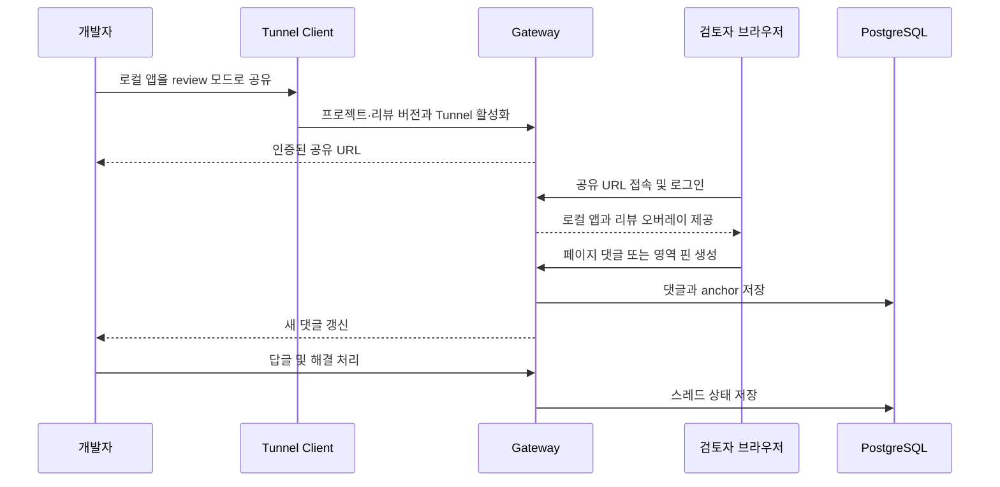
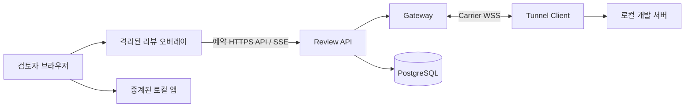

# 화면 맥락 리뷰 제품·기술 설계

> 상태: 제품 방향 승인, 구현 전 설계
>
> 기준일: 2026-08-31
>
> 이 문서의 기능은 아직 현재 릴리스에 포함되지 않았다. `0.1.0`이 제공하는 인증·중계 기반 위에 추가할 다음 제품 단계를 정의한다.

## 1. 제품 정의

Review Tunnel은 범용 네트워크 터널이 아니라 **로컬 웹앱을 공유하고 화면의 맥락 안에서 피드백을 주고받는 리뷰 도구**를 지향한다.

개발자는 별도 Preview 배포를 만들지 않고 로컬 개발 서버를 공유한다. 검토자는 별도 프로그램이나 브라우저 확장 설치 없이 공유 URL을 열고, 페이지 전체 또는 특정 영역에 댓글을 남긴다. 개발자는 같은 댓글 스레드에서 답변하고 수정 사항을 반영한 뒤 해결 처리한다.

제품의 한 문장 약속은 다음과 같다.

> 로컬 웹앱을 안전하게 공유하고, 화면 위에서 바로 리뷰받는다.

### 1.1 해결하려는 문제

- 작은 UI 변경을 검토받기 위해 Preview 환경을 매번 배포해야 한다.
- 메신저에 남긴 “두 번째 카드의 버튼” 같은 피드백은 어떤 화면과 영역을 말하는지 쉽게 잃어버린다.
- 화면이 수정되면 기존 스크린샷과 댓글의 기준 버전을 알기 어렵다.
- 범용 터널은 화면을 보여 주지만 리뷰의 수집, 대화, 해결 상태까지 다루지 않는다.

### 1.2 핵심 사용자

- **개발자:** 로컬 앱을 공유하고 댓글에 답하며 해결 상태를 관리한다.
- **검토자:** 공유 URL을 브라우저에서 열고 페이지 또는 영역에 피드백을 남긴다.
- **운영자:** 계정, 접근 권한, Gateway와 PostgreSQL을 관리한다.

### 1.3 제품 원칙

1. 검토자는 공유 URL 외에 별도 설치가 필요 없어야 한다.
2. 댓글은 일회성 Tunnel이 아니라 프로젝트와 리뷰 버전에 귀속되어야 한다.
3. 리뷰 기능을 끄면 기존 앱 중계 동작이 달라지지 않아야 한다.
4. 앱의 요청·응답 본문, DOM 텍스트와 화면 이미지는 명시적 동의 없이 수집하지 않는다.
5. 정밀한 자동 요소 추적보다 예측 가능한 페이지·영역 댓글을 먼저 제공한다.

## 2. 목표 사용자 흐름



1. 개발자가 로컬 앱을 실행한다.
2. 개발자가 프로젝트 식별자와 리뷰 버전을 지정해 review 모드로 공유한다.
3. Client는 기존 인증·활성화 절차를 거쳐 공유 URL을 출력한다.
4. 검토자가 URL을 열고 `REVIEWER` 계정으로 로그인한다.
5. 오버레이에서 현재 페이지에 대한 댓글을 보거나 `댓글 달기`를 선택한다.
6. 검토자는 페이지 댓글을 작성하거나 화면의 한 지점을 클릭해 번호 핀을 만든다.
7. 개발자와 검토자는 스레드에서 답글을 주고받는다.
8. 개발자가 수정 후 스레드를 해결 처리한다.
9. 새 Tunnel을 열어도 같은 프로젝트·리뷰 버전이면 기존 댓글을 다시 볼 수 있다.

## 3. 범위

### 3.1 첫 리뷰 MVP

- URL path 단위의 페이지 댓글
- 문서 좌표 비율을 이용한 클릭 위치 번호 핀
- 댓글 스레드와 답글
- `OPEN`, `RESOLVED` 상태
- 프로젝트와 리뷰 버전 연결
- 현재 페이지의 미해결 댓글 개수 표시
- 댓글 생성·답글·상태 변경의 실시간 갱신
- Vite와 Next.js 공식 fixture에서 오버레이 호환성 검증

### 3.2 첫 리뷰 MVP의 비목표

- 모든 DOM 변경을 견디는 자동 요소 추적
- 디자인 파일과의 픽셀 비교
- 화면 녹화, 자동 스크린샷 또는 DOM 본문 수집
- `@mention`, 이메일·메신저 알림
- GitHub Pull Request나 이슈 자동 연동
- 익명 댓글과 공개 링크만으로 쓰기 권한을 주는 방식
- 음성·영상 피드백과 파일 첨부
- 범용 애널리틱스, 세션 리플레이 또는 사용자 행동 추적

## 4. 기능별 동작

### 4.1 페이지 댓글

페이지 댓글은 특정 좌표 없이 정규화한 URL path에 연결한다. SPA의 client navigation이 발생하면 오버레이는 현재 path에 맞는 댓글 목록을 갱신한다.

기본적으로 URL fragment는 저장하지 않는다. Query string은 token이나 검색어 등 민감한 값을 포함할 수 있으므로 첫 버전에서는 댓글 식별자에서 제외한다. 실제 파일럿에서 query별 화면 구분이 필요하면 프로젝트별 allowlist를 별도 결정한다.

### 4.2 영역 핀

검토자가 `댓글 달기`를 누르고 화면의 지점을 선택하면 번호 핀과 작성 창을 표시한다. 첫 버전의 anchor는 문서 전체 크기에 대한 비율 좌표를 사용한다.

```text
x_ratio = click_x / document_width
y_ratio = click_y / document_height
```

저장 시 viewport 너비·높이와 문서 너비·높이도 진단 정보로 함께 기록한다. 화면 구조가 크게 바뀌어 원래 지점을 신뢰하기 어려우면 핀을 억지로 정확한 요소에 붙이지 않고 “위치가 변경되었을 수 있음” 상태로 표시한다.

### 4.3 요소 anchor 확장

영역 핀이 검증된 뒤 다음 순서로 요소 anchor를 확장한다.

1. 앱이 명시한 안정적인 `data-review-id`
2. 안정적인 `id`, 역할, 이름 등 제한된 속성 fingerprint
3. tag, 제한된 텍스트 hash, 주변 bounding box와 좌표를 조합한 fallback

생성 시점의 CSS selector만 저장하는 방식은 DOM 삽입과 class hash 변경에 쉽게 깨지므로 단독 anchor로 사용하지 않는다. 요소를 다시 찾지 못하면 저장된 영역 좌표로 안전하게 fallback한다.

### 4.4 스레드 상태

- 댓글 작성자는 자신의 댓글과 답글을 수정할 수 있다.
- 개발자와 댓글 작성자는 스레드에 답글을 남길 수 있다.
- 개발자는 스레드를 `RESOLVED`로 바꾸거나 다시 열 수 있다.
- 댓글과 답글은 기본적으로 hard delete하지 않고 감사 가능한 수정·숨김 정책을 사용한다. 정확한 보존 기간은 파일럿 전에 확정한다.

## 5. 시스템 설계



### 5.1 오버레이 전달 방식

기본 방식은 **명시적으로 활성화하는 개발 서버 integration**이다.

- Client의 review 모드를 켠 프로젝트만 오버레이 bootstrap을 로드한다.
- Vite plugin, Next.js 개발용 integration과 generic script snippet을 얇은 adapter로 제공한다.
- bootstrap은 공유 콘텐츠 host의 `/_review-tunnel/review/*` 예약 경로에서 오버레이 asset과 API를 사용한다.
- 오버레이 UI는 Shadow DOM 안에서 렌더링해 앱 CSS와의 충돌을 줄인다.
- 오버레이 host는 기본적으로 `pointer-events: none`이고 toolbar, pin, sidebar처럼 필요한 부분만 입력을 받는다.
- review 모드가 아니거나 bootstrap이 실패하면 원래 앱은 그대로 동작해야 한다.

Gateway가 모든 HTML 응답을 자동으로 다시 쓰는 방식은 기본값으로 사용하지 않는다. 이 방식은 압축, `Content-Length`, CSP, streaming HTML, RSC와 HMR 동작을 변경하고 현재 중계 계층의 의미 투명성을 약화시킬 수 있다.

브라우저 확장이나 bookmarklet은 검토자 설치를 요구하므로 필수 경로로 사용하지 않는다. 향후 선택적 고급 도구로는 고려할 수 있다.

### 5.2 Gateway 예약 경로

Review API와 asset은 로컬 앱으로 전달하지 않는 Gateway 예약 namespace를 사용한다. 아래 경로는 계약을 설명하기 위한 초안이며 구현 전 API review에서 확정한다.

```text
GET    /_review-tunnel/review/bootstrap.js
GET    /_review-tunnel/review/context
GET    /_review-tunnel/review/comments?path=/products
POST   /_review-tunnel/review/comments
POST   /_review-tunnel/review/comments/:commentId/replies
PATCH  /_review-tunnel/review/comments/:commentId/status
GET    /_review-tunnel/review/events
```

`context`는 현재 사용자의 표시 이름과 역할, 프로젝트, 리뷰 버전 및 쓰기 가능 여부만 반환한다. 앱 Cookie, 앱 응답 본문이나 Gateway credential은 반환하지 않는다.

### 5.3 데이터 모델

Tunnel과 리뷰 데이터의 수명주기를 분리한다.

| 개체 | 핵심 필드 | 수명 |
| --- | --- | --- |
| Project | `id`, `owner_account_id`, `slug`, `display_name` | 여러 공유에 걸쳐 유지 |
| Review revision | `id`, `project_id`, `revision_key`, `created_by`, `created_at` | 동일 검토 기준 버전 동안 유지 |
| Tunnel binding | `tunnel_id`, `review_revision_id` | Client 실행부터 종료까지 임시 유지 |
| Comment thread | `id`, `revision_id`, `route_path`, `anchor_type`, `anchor`, `status`, `author_id` | 정책에 따른 영속 데이터 |
| Reply | `id`, `thread_id`, `author_id`, `body`, `created_at`, `edited_at` | Thread와 함께 유지 |

`revision_key`의 기본 후보는 Git commit SHA다. Git 정보를 사용할 수 없으면 Client가 명시적으로 받은 이름이나 생성한 opaque revision ID를 사용한다. Branch 이름만으로는 시간이 지나면서 내용이 바뀌므로 단독 revision key로 사용하지 않는다.

Anchor 예시:

```json
{
  "type": "REGION",
  "xRatio": 0.42,
  "yRatio": 0.31,
  "viewport": { "width": 1440, "height": 900 },
  "document": { "width": 1440, "height": 2840 }
}
```

### 5.4 실시간 갱신

첫 버전은 Gateway의 별도 Review SSE endpoint로 댓글 생성, 답글과 상태 변경을 전달한다. 이 채널은 로컬 앱의 SSE·WebSocket 및 Client–Gateway Carrier와 별개다.

이벤트는 전체 댓글 본문을 무제한 broadcast하지 않고 권한이 확인된 현재 프로젝트·리뷰 버전 구독자에게만 전달한다. 연결이 끊기면 마지막 이벤트 ID 이후를 제한적으로 다시 받거나 현재 목록을 재조회한다.

## 6. 인증·인가와 보안 경계

### 6.1 권한

| 작업 | `REVIEWER` | `DEVELOPER` | `ADMIN` |
| --- | --- | --- | --- |
| 허용된 리뷰 열람 | 가능 | 가능 | 운영 정책에 따라 가능 |
| 댓글·답글 작성 | 가능 | 가능 | 운영 정책에 따라 가능 |
| 스레드 해결·다시 열기 | 불가 | 가능 | 가능 |
| 프로젝트·리뷰 버전 생성 | 불가 | 가능 | 가능 |

Tunnel URL을 안다는 사실만으로 댓글을 읽거나 쓸 수 없다. 기존 content session 인증과 서버 측 역할 검사를 모두 통과해야 한다.

### 6.2 입력과 출력

- 댓글은 plain text를 기본으로 하고 HTML을 신뢰하지 않는다.
- Markdown을 지원할 경우 allowlist 기반 sanitizer를 적용한 렌더링 결과만 표시한다.
- 댓글, 표시 이름, route와 anchor를 로그 메시지에 그대로 넣지 않는다.
- 댓글 길이, 답글 수, 프로젝트별 생성 속도와 SSE 연결 수에 상한을 둔다.
- 모든 mutation은 정확한 content origin 검증과 CSRF 방어를 적용한다.
- Review API의 응답에는 `Cache-Control: no-store`를 적용한다.

### 6.3 개인정보와 민감한 화면

- 앱의 HTTP body, WebSocket payload, DOM 전체와 Cookie를 댓글 기능이 자동 저장하지 않는다.
- 선택한 요소의 텍스트는 원문 대신 제한된 길이의 hash나 사용자가 확인한 발췌만 사용한다.
- 스크린샷은 첫 MVP에서 제외한다. 추가할 경우 매번 사용자가 캡처 범위를 확인하는 opt-in 기능으로 설계한다.
- Query string은 기본적으로 댓글 식별과 저장에서 제외한다.
- 보존 기간, export와 삭제 정책은 실제 파일럿 데이터 분류 후 확정한다.

### 6.4 앱과의 격리

- `/_review-tunnel/review/*` 요청은 로컬 앱에 전달하지 않는다.
- Gateway 인증 Cookie와 review 내부 header를 로컬 앱에 전달하지 않는다.
- 로컬 앱 Cookie를 Review API의 인증이나 저장 데이터로 사용하지 않는다.
- 오버레이 전역 객체, DOM ID, CSS와 keyboard shortcut은 product namespace로 격리한다.
- 앱의 CSP가 strict nonce 정책을 사용하는 경우 integration이 명시적으로 호환 설정을 제공하며 보안 정책을 임의로 약화하지 않는다.

## 7. 구현 순서

### 단계 1 — 최소 세로 기능

- Project, review revision, Tunnel binding 저장 모델
- 예약 Review API와 기존 content session authorization 연결
- 페이지 댓글 생성·조회
- Shadow DOM sidebar와 현재 path 변경 감지
- 댓글 plain-text 처리와 XSS·CSRF·권한 테스트

### 단계 2 — 리뷰 MVP 완성

- 클릭 위치 영역 핀
- 답글과 해결·다시 열기
- SSE 실시간 갱신
- Vite·Next.js integration과 framework E2E
- 재접속·새 Tunnel에서도 동일 revision 댓글 유지

### 단계 3 — 파일럿 후 확장

- `data-review-id` 기반 요소 anchor
- 선택적 스크린샷과 민감 정보 확인 흐름
- 멘션·알림
- Git commit·Pull Request 연결
- 프로젝트별 초대와 더 세밀한 권한

## 8. 리뷰 MVP 인수 기준

1. 검토자는 브라우저 외 별도 설치 없이 공유 URL에서 댓글을 볼 수 있다.
2. 인증되지 않았거나 권한이 없는 사용자는 댓글 존재 여부도 알 수 없다.
3. `/products`에 남긴 페이지 댓글은 다른 path에서 기본적으로 보이지 않는다.
4. 영역 핀은 같은 revision과 유사한 문서 크기에서 저장 위치에 다시 표시된다.
5. 댓글, 답글과 해결 상태는 Gateway나 Tunnel 재시작 뒤에도 유지된다.
6. 새 Tunnel ID를 발급받아도 같은 프로젝트·revision을 선택하면 기존 댓글을 볼 수 있다.
7. 다른 프로젝트 또는 revision의 댓글이 섞이지 않는다.
8. 악성 댓글 문자열이 앱 또는 오버레이에서 script로 실행되지 않는다.
9. Review API 요청과 Cookie가 로컬 앱에 전달되지 않는다.
10. 오버레이를 끈 공유는 기존 HTTP, SSE, WebSocket, Vite HMR과 Next.js Fast Refresh 동작을 유지한다.
11. 오버레이를 켠 상태에서도 공식 Vite·Next.js fixture의 탐색과 갱신이 정상 동작한다.
12. 댓글 기능은 앱 body, DOM 전체, 화면 이미지나 앱 Cookie를 자동 저장하지 않는다.

## 9. 파일럿 전에 확정할 항목

| 항목 | 제안 기본값 | 확인할 내용 |
| --- | --- | --- |
| 프로젝트 식별 | 개발자가 지정한 stable slug | 동일 slug 소유권과 rename 정책 |
| 리뷰 버전 | Git commit SHA 우선, opaque ID fallback | dirty working tree 표현 방식 |
| Query string | 저장·식별에서 제외 | query별 화면이 핵심인 앱의 allowlist 필요 여부 |
| 댓글 보존 | 프로젝트 소유자가 삭제하기 전 유지 | 조직 정책과 export 필요 여부 |
| 해결 권한 | `DEVELOPER`, `ADMIN` | 댓글 작성자의 self-resolve 허용 여부 |
| 오버레이 integration | Vite·Next.js·generic snippet | 첫 파일럿 대상 프레임워크 우선순위 |
| 표시 이름 | 기존 account `display_name` | 변경 이력과 비활성 계정 표시 방식 |

이 표의 결정이 바뀌어도 Tunnel relay protocol `review-tunnel.v1`에 리뷰 데이터 메시지를 추가하지 않는다. 리뷰 기능은 Gateway의 인증된 HTTP API와 저장소 경계에서 독립적으로 발전시킨다.
