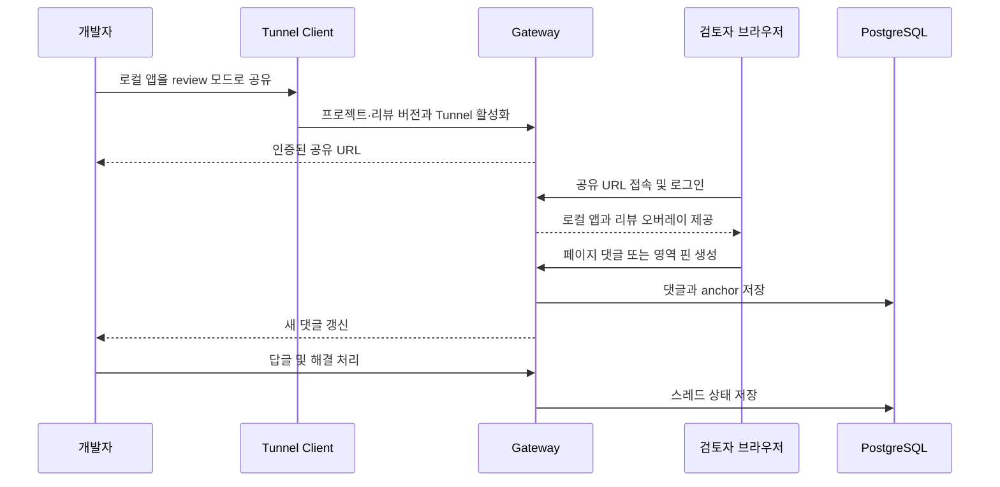
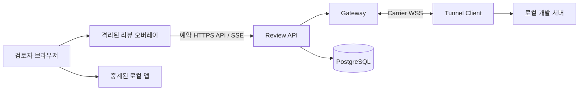

# 화면 맥락 리뷰 제품·기술 설계

> 상태: 화면 맥락 리뷰 MVP 구현 완료, 환경별 운영 인수 대기
>
> 기준일: 2026-09-08
>
> 내부 팀 개선 사용법과 배포 설정: [내부 리뷰 안내](internal-review-guide.md). Control 리뷰함·초안 보존·필터·재검토·통합 알림을 추가했다.
>
> 현재 소스 트리는 stable Project·Review revision·Tunnel binding, 페이지·영역 댓글, 답글, 버전 기반 수정·삭제 tombstone, Developer 해결·다시 열기, Review SSE, 참여자 멘션·내부 알림, PostgreSQL 영속화, generic Shadow DOM sidebar와 Vite·Next.js integration을 구현한다.

## 1. 제품 정의

Review Tunnel은 범용 네트워크 터널이 아니라 **로컬 웹앱을 공유하고 화면의 맥락 안에서 피드백을 주고받는 리뷰 도구**를 지향한다.

개발자는 별도 Preview 배포를 만들지 않고 로컬 개발 서버를 공유한다. 검토자는 별도 프로그램이나 브라우저 확장 설치 없이 공유 URL을 열고, 페이지 전체 또는 특정 영역에 댓글을 남긴다. 개발자는 같은 댓글 스레드에서 답변하고 수정 사항을 반영한 뒤 해결 처리한다.

제품의 한 문장 약속은 다음과 같다.

> 로컬 웹앱을 안전하게 공유하고, 화면 위에서 바로 리뷰받는다.

### 1.1 해결하려는 문제

- 작은 UI 변경을 검토받기 위해 Preview 환경을 매번 배포해야 한다.
- 메신저에 남긴 “두 번째 카드의 버튼” 같은 피드백은 어떤 화면과 영역을 말하는지 쉽게 잃어버린다.
- 화면이 수정되면 기존 스크린샷과 댓글의 기준 버전을 알기 어렵다.
- 범용 터널은 화면을 보여 주지만 리뷰의 수집, 대화, 해결 상태까지 다루지 않는다.

### 1.2 핵심 사용자

- **개발자:** 로컬 앱을 공유하고 댓글에 답하며 해결 상태를 관리한다.
- **검토자:** 공유 URL을 브라우저에서 열고 페이지 또는 영역에 피드백을 남긴다.
- **운영자:** 계정, 접근 권한, Gateway와 PostgreSQL을 관리한다.

### 1.3 제품 원칙

1. 검토자는 공유 URL 외에 별도 설치가 필요 없어야 한다.
2. 댓글은 일회성 Tunnel이 아니라 프로젝트와 리뷰 버전에 귀속되어야 한다.
3. 리뷰 기능을 끄면 기존 앱 중계 동작이 달라지지 않아야 한다.
4. 앱의 요청·응답 본문, DOM 텍스트와 화면 이미지는 명시적 동의 없이 수집하지 않는다.
5. 정밀한 자동 요소 추적보다 예측 가능한 페이지·영역 댓글을 먼저 제공한다.

## 2. 목표 사용자 흐름



1. 개발자가 로컬 앱을 실행한다.
2. 개발자가 프로젝트 식별자와 리뷰 버전을 지정해 review 모드로 공유한다.
3. Client는 기존 인증·활성화 절차를 거쳐 공유 URL을 출력한다.
4. 검토자가 URL을 열고 `REVIEWER` 계정으로 로그인한다.
5. 오버레이에서 현재 페이지에 대한 댓글을 보거나 `댓글 달기`를 선택한다.
6. 검토자는 페이지 댓글을 작성하거나 화면의 한 지점을 클릭해 번호 핀을 만든다.
7. 개발자와 검토자는 스레드에서 답글을 주고받는다.
8. 개발자가 수정 후 스레드를 해결 처리한다.
9. 새 Tunnel을 열어도 같은 프로젝트·리뷰 버전이면 기존 댓글을 다시 볼 수 있다.

## 3. 범위

### 3.1 구현된 Phase 1

- URL path 단위의 페이지 댓글
- 소유자별 프로젝트와 프로젝트별 리뷰 버전 연결
- 현재 Tunnel session의 임시 binding과 새 Tunnel에서의 동일 revision 댓글 재사용
- `DEVELOPER`와 `REVIEWER`의 페이지 댓글 조회·작성
- generic script로 켜는 Shadow DOM sidebar
- `pushState`, `replaceState`, `popstate` 기반 path 변경 반영
- plain-text 렌더링, exact Origin, 입력 크기와 예약 path 격리

### 3.2 구현된 Phase 2 대화 슬라이스

- `DEVELOPER`와 `REVIEWER`의 plain-text 답글
- `OPEN`, `NEEDS_REVIEW`, `RESOLVED` 상태와 `DEVELOPER`의 해결·다시 열기
- 해결된 스레드의 새 답글 거부
- `expectedStatus`와 `expectedWorkflowVersion`을 함께 이용한 상태 변경 경합 감지
- 기존 Phase 1 thread row를 유지하는 additive PostgreSQL migration

### 3.3 구현된 리뷰 MVP 완성 범위

- 정규화 문서 좌표를 이용한 클릭 위치 핀과 드래그 사각 영역
- 현재 페이지의 미해결 댓글 개수 표시
- 댓글·답글의 수정·삭제 tombstone과 `expectedVersion` 충돌 감지
- 댓글 생성·답글·상태·콘텐츠·멘션 알림 변경의 Review 전용 SSE 갱신
- 프로젝트 참여자 제한 `@username` 멘션과 읽음·안 읽음 내부 알림
- Vite와 Next.js integration 및 실제 fixture의 오버레이·탐색·갱신 호환성 검증
- 최신 댓글·답글을 먼저 보장하는 안정 키셋 cursor, 더 오래된 항목 불러오기와 전체 열린 댓글 수
- revision·path별로 생성 뒤 바뀌지 않는 영역 핀 번호
- 만료 시각을 가진 Tunnel binding과 비정상 종료 뒤 만료 binding만 회수하는 재연결

### 3.4 리뷰 MVP의 비목표

- 모든 DOM 변경을 견디는 자동 요소 추적
- 디자인 파일과의 픽셀 비교
- 화면 녹화, 자동 스크린샷 또는 DOM 본문 수집
- 이메일·메신저·모바일 push 같은 외부 알림
- 댓글·답글의 전체 편집 이력 보관
- GitHub Pull Request나 이슈 자동 연동
- 익명 댓글과 공개 링크만으로 쓰기 권한을 주는 방식
- 음성·영상 피드백과 파일 첨부
- 범용 애널리틱스, 세션 리플레이 또는 사용자 행동 추적

## 4. 기능별 동작

### 4.1 페이지 댓글

페이지 댓글은 특정 좌표 없이 정규화한 URL path에 연결한다. SPA의 client navigation이 발생하면 오버레이는 현재 path에 맞는 댓글 목록을 갱신한다.

기본적으로 URL fragment는 저장하지 않는다. Query string은 token이나 검색어 등 민감한 값을 포함할 수 있으므로 첫 버전에서는 댓글 식별자에서 제외한다. 실제 파일럿에서 query별 화면 구분이 필요하면 프로젝트별 allowlist를 별도 결정한다.

### 4.2 영역 핀

검토자가 영역 선택을 켠 뒤 화면의 지점을 클릭하면 번호 핀을, 드래그하면 사각 영역과 작성 창을 표시한다. `Esc`는 선택을 취소한다. anchor는 문서 전체 크기에 대한 비율 좌표를 사용하며 값 객체에서 유한 수, 범위, 크기와 exact key를 검증한다.

```text
x_ratio = click_x / document_width
y_ratio = click_y / document_height
```

저장 시 viewport 너비·높이와 문서 너비·높이도 CSS pixel 단위로 함께 기록한다. POINT는 너비·높이 0, RECT는 양수 크기를 갖는 `REGION_V1`으로 저장한다. 요소 정보가 없는 기존 핀과 좌표 핀은 점선과 대략적인 좌표임을 표시한다. 현재 viewport 너비 또는 문서 너비·높이가 저장 값과 2px 넘게 다르면 핀을 숨기고 목록에 레이아웃 차이를 안내한다. 크기가 같아도 콘텐츠가 바뀌면 정확성을 보장하지 않는다.

`Hide all pins`로 핀을 모두 숨겨도 댓글은 유지된다. 각 댓글의 `Show pin`·`Hide pin`으로 필요한 핀만 켜고 끌 수 있다. 전역 설정은 같은 탭의 새로고침 뒤에도 유지되고, 개별 설정은 SSE 갱신 동안 유지하되 경로 이동·새로고침 때 초기화한다. 다른 검토자의 표시 설정이나 서버 데이터에는 영향을 주지 않는다. 사각 영역의 내부는 연하게 표시하며 앱 클릭을 가로채지 않는다.

댓글의 `Pin #…` 버튼은 표시 상태와 별개로 해당 핀을 켜고 그 위치로 이동한다. 세로·가로 페이지 스크롤과 요소가 속한 스크롤 컨테이너를 함께 이동한다.

### 4.3 요소 anchor

새 선택 영역의 중심 아래 요소부터 조상을 탐색해, 선택 영역 전체를 포함하고 페이지 안에서 유일한 다음 식별자를 찾는다.

1. 앱이 명시한 안정적인 `data-review-id`
2. `id` (문서 전체를 덮는 앱 wrapper는 제외)

`REGION_V1`의 선택적 `element`에 속성 이름·값과 요소 내부의 비율 좌표를 저장한다. 속성 이름은 `data-review-id`와 `id`만 허용하고, 값은 제어 문자 없이 1–256자로 제한하며 비율 좌표도 서버에서 검증한다. 임의 selector, class, 텍스트 또는 자식 순서로 대상을 추측하지 않는다. 기존 좌표 핀을 읽을 수 있고 JSONB의 선택적 필드를 사용하므로 DB schema 변경은 없다. 새 요소 정보가 있는 핀을 쓰는 Gateway는 모두 이 필드를 지원하는 버전이어야 한다.

현재 요소의 크기와 위치를 기준으로 핀을 배치하므로 화면 크기가 바뀌어 카드가 다른 줄로 이동해도 해당 카드 안의 상대 영역을 따른다. 요소가 없거나 숨겨졌거나 식별자가 중복되면 잘못된 좌표로 대체하지 않고 핀을 숨긴 뒤 목록에 이유를 표시한다. 다시 사용 가능해지면 사용자의 표시 설정에 따라 복원한다. scroll·resize·DOM 변경·이미지 로딩·CSS 전환 완료 시 위치를 갱신한다.

이는 DOM 요소 내부의 상대 영역이며 React 컴포넌트나 텍스트 줄을 식별하는 기능은 아니다. 개발자가 식별자를 다른 콘텐츠에 재사용하면 잘못 연결될 수 있다. iframe·Shadow DOM 내부 탐색과 스크린샷은 지원하지 않으며, 기존 핀에는 요소 식별자가 자동으로 추가되지 않는다.

### 4.4 스레드 상태

- 개발자와 검토자는 열린 스레드에 답글을 남길 수 있다.
- 개발자는 스레드를 `RESOLVED`로 바꾸거나 다시 열 수 있다.
- 해결된 스레드는 다시 열기 전까지 새 답글을 받지 않는다.
- 상태 변경은 화면이 알고 있는 `expectedStatus`와 DB의 현재 상태가 다르면 `409` 충돌로 실패한다.
- 작성자는 열린 스레드의 자기 댓글·답글만 수정할 수 있다.
- 작성자 또는 `DEVELOPER`는 명시적 확인 뒤 댓글·답글을 삭제할 수 있다.
- 삭제는 본문을 `NULL`로 제거하고 작성자·답글 관계를 유지하는 tombstone이다.
- 수정·삭제는 `expectedVersion`과 현재 version이 다르면 `409` 충돌로 실패한다.

## 5. 시스템 설계



### 5.1 오버레이 전달 방식

기본 방식은 **명시적으로 활성화하는 개발 서버 integration**이다. generic script와 제거 가능한 Vite·Next.js adapter를 함께 제공한다.

- Client의 review 모드를 켠 프로젝트만 오버레이 bootstrap을 로드한다.
- generic script snippet은 review 전용 HTML entry에 직접 넣을 수 있다.
- Vite plugin은 개발 서버의 `transformIndexHtml`로 bootstrap만 주입하고 Tunnel 프로세스 수명주기는 CLI에 둔다.
- Next.js integration은 개발 모드에서만 새 값으로 `allowedDevOrigins`를 병합하고 root layout용 script props를 제공하며 production에서는 둘 다 비활성화된다.
- 두 integration tarball은 컴파일된 JavaScript·타입 선언만 포함하고 비공개 workspace 패키지에 의존하지 않는다.
- bootstrap은 공유 콘텐츠 host의 `/_review-tunnel/review/*` 예약 경로에서 오버레이 asset과 API를 사용한다.
- 오버레이 UI는 Shadow DOM 안에서 렌더링해 앱 CSS와의 충돌을 줄인다.
- 오버레이 host는 기본적으로 `pointer-events: none`이고 toolbar, pin, sidebar처럼 필요한 부분만 입력을 받는다.
- review 모드가 아니거나 bootstrap이 실패하면 원래 앱은 그대로 동작해야 한다.

Gateway가 모든 HTML 응답을 자동으로 다시 쓰는 방식은 기본값으로 사용하지 않는다. 이 방식은 압축, `Content-Length`, CSP, streaming HTML, RSC와 HMR 동작을 변경하고 현재 중계 계층의 의미 투명성을 약화시킬 수 있다.

브라우저 확장이나 bookmarklet은 검토자 설치를 요구하므로 필수 경로로 사용하지 않는다. 향후 선택적 고급 도구로는 고려할 수 있다.

### 5.2 Gateway 예약 경로

Review API와 asset은 로컬 앱으로 전달하지 않는 Gateway 예약 namespace를 사용한다. 현재 구현 계약은 다음과 같다.

```text
PUT    /api/client/review-bindings/:tunnelId
GET    /_review-tunnel/review/bootstrap.js
GET    /_review-tunnel/review/context
GET    /_review-tunnel/review/comments?path=/products[&before=cursor]
POST   /_review-tunnel/review/comments
PATCH  /_review-tunnel/review/comments/:commentId
DELETE /_review-tunnel/review/comments/:commentId
POST   /_review-tunnel/review/comments/:commentId/replies
GET    /_review-tunnel/review/comments/:commentId/replies?path=/products[&before=cursor]
PATCH  /_review-tunnel/review/comments/:commentId/replies/:replyId
DELETE /_review-tunnel/review/comments/:commentId/replies/:replyId
PATCH  /_review-tunnel/review/comments/:commentId/status
GET    /_review-tunnel/review/events?path=/products
GET    /_review-tunnel/review/notifications?path=/products
PATCH  /_review-tunnel/review/notifications/:notificationId
```

`PATCH .../status`는 `path`, `expectedStatus`, `expectedWorkflowVersion`, `status`를 받고 transaction 안에서 예상 상태를 비교한다. 답글과 상태 API도 현재 binding의 정확한 revision과 path에서만 thread를 찾는다.
댓글·답글 PATCH·DELETE는 `path`와 `expectedVersion`을 받고, PATCH는 새 plain-text `body`도 받는다. 알림 PATCH는 `path`와 `read`를 받는다. 다른 project·revision·path 또는 수신자에게 속한 ID는 존재하지 않는 것처럼 응답한다.

댓글 목록 응답은 현재 page에 적재한 `comments`, 전체 `openCount`, 다음 오래된 page의 불투명 `pageInfo.nextCursor`를 반환한다. 각 thread의 초기 답글에도 독립적인 `replyPageInfo`가 있다. 새 cursor는 생성 시각·ID와 revision·path·상태·작성자 조건의 해시를 담고 exact 형식으로 검증한다. 다른 조건에 재사용하면 거부한다.

`context`는 현재 사용자의 표시 이름과 역할, 프로젝트, 리뷰 버전 및 쓰기 가능 여부만 반환한다. 앱 Cookie, 앱 응답 본문이나 Gateway credential은 반환하지 않는다.

### 5.3 데이터 모델

Tunnel과 리뷰 데이터의 수명주기를 분리한다.

| 개체 | 핵심 필드 | 수명 |
| --- | --- | --- |
| Project | `id`, `owner_account_id`, `slug`, `display_name` | 여러 공유에 걸쳐 유지 |
| Review revision | `id`, `project_id`, `revision_key`, `created_by`, `created_at` | 동일 검토 기준 버전 동안 유지 |
| Tunnel binding | `tunnel_id`, `session_id`, `review_revision_id`, `owner_account_id`, `expires_at` | Client 실행부터 종료 또는 session 최대 수명까지 임시 유지 |
| Comment thread | `id`, `revision_id`, `route_path`, `anchor_type`, `anchor`, `pin_number`, `body`, `version`, `status`, `author_id`, `deleted_by`, `deleted_at` | 정책에 따른 영속 데이터 |
| Reply | `id`, `thread_id`, `author_id`, `body`, `version`, `deleted_by`, `deleted_at` | Thread와 함께 유지 |
| Review event | 단조 `id`, `revision_id`, `route_path`, `thread_id`, `type`, 선택적 `recipient_account_id` | 수량·기간 상한 안에서 SSE replay용 유지 |
| Mention·notification | content·recipient 매핑, `read_at`, `created_at` | revision·path와 수신자 범위에 유지 |

`revision_key`의 기본 후보는 Git commit SHA다. 현재 CLI는 `--review-project`와 `--review-revision`을 함께 받은 경우에만 review mode를 켜며 revision 값을 자동 생성하지 않는다. Git 정보를 사용할 수 없으면 개발자가 변경되지 않는 opaque revision ID를 명시한다. Branch 이름만으로는 시간이 지나면서 내용이 바뀌므로 단독 revision key로 사용하지 않는다.

`Comment thread`는 `PAGE` 또는 `REGION_V1` anchor를 가지며 `OPEN`·`NEEDS_REVIEW`·`RESOLVED`를 전이한다. Reply는 별도 테이블에 저장한다. 댓글·답글 삭제는 row를 제거하지 않고 본문을 비운 tombstone으로 보존한다. 이벤트와 알림은 콘텐츠 mutation transaction에서 함께 기록한다.

Anchor 예시:

```json
{
  "type": "REGION_V1",
  "selection": "RECT",
  "x": 0.42,
  "y": 0.31,
  "width": 0.18,
  "height": 0.09,
  "viewport": { "width": 1440, "height": 900 },
  "document": { "width": 1440, "height": 2840 }
}
```

### 5.4 실시간 갱신

Gateway의 별도 Review SSE endpoint가 댓글·답글 생성, 상태 전이, 수정·삭제와 수신자별 알림 생성을 전달한다. 이 채널은 로컬 앱의 SSE·WebSocket 및 Client–Gateway Carrier와 별개다.

이벤트는 댓글 본문을 broadcast하지 않고 권한이 확인된 현재 project·revision·path 구독자에게만 전달한다. 알림 이벤트는 정확한 수신자에게만 보인다. PostgreSQL 단조 ID와 `Last-Event-ID`로 제한적 replay를 지원하고 heartbeat, 전역·계정별 연결 상한, write backpressure, 수량·기간 보존 정책을 적용한다. 연결 중에도 authorization version과 binding을 재검증하며 여러 Gateway 인스턴스는 같은 event log를 polling한다. 브라우저는 event burst 동안 목록 조회를 하나만 실행하고 dirty 표시를 남겨 완료 뒤 한 번만 추가 조회한다. 각 조회는 시작 path를 캡처해 SPA가 이미 이동한 뒤 도착한 응답을 렌더링하지 않는다.

## 6. 인증·인가와 보안 경계

### 6.1 권한

| 작업 | `REVIEWER` | `DEVELOPER` | `ADMIN` |
| --- | --- | --- | --- |
| 허용된 리뷰 열람 | 가능 | 가능 | 해당 역할을 함께 가진 경우 |
| 댓글·답글 작성 | 가능 | 가능 | 해당 역할을 함께 가진 경우 |
| 자기 댓글·답글 수정 | 열린 스레드에서 가능 | 열린 스레드에서 가능 | 해당 역할을 함께 가진 경우 |
| 댓글·답글 삭제 | 자기 콘텐츠 가능 | 자기 콘텐츠와 프로젝트 콘텐츠 가능 | 해당 역할을 함께 가진 경우 |
| 참여자 멘션·내부 알림 | 가능 | 가능 | 해당 역할을 함께 가진 경우 |
| 스레드 해결·다시 열기 | 불가 | 가능 | `DEVELOPER`를 함께 가진 경우 |
| 프로젝트·리뷰 버전 생성 | 불가 | 가능 | `DEVELOPER`를 함께 가진 경우 |

Tunnel URL을 안다는 사실만으로 댓글을 읽거나 쓸 수 없다. 기존 content session 인증과 서버 측 역할 검사를 모두 통과해야 한다.

현재 `DEVELOPER`·`REVIEWER`의 공유 화면 접근 권한은 배포 전체에 적용된다. Project·revision·path별 데이터 구분은 프로젝트별 사람 접근 목록이 아니다. 유효한 주소에 접근한 `DEVELOPER`는 다른 개발자의 스레드도 해결·다시 열기·삭제할 수 있다. Project·revision을 Tunnel에 연결할 때는 해당 Tunnel 소유자 일치도 검사한다.

### 6.2 입력과 출력

- 댓글은 plain text를 기본으로 하고 HTML을 신뢰하지 않는다.
- Markdown을 지원할 경우 allowlist 기반 sanitizer를 적용한 렌더링 결과만 표시한다.
- 댓글, 표시 이름, route와 anchor를 로그 메시지에 그대로 넣지 않는다.
- 댓글 길이, 답글 수, 프로젝트별 생성 속도와 SSE 연결 수에 상한을 둔다.
- 모든 mutation은 정확한 content origin 검증과 CSRF 방어를 적용한다.
- Review API의 응답에는 `Cache-Control: no-store`를 적용한다.

### 6.3 개인정보와 민감한 화면

- 앱의 HTTP body, WebSocket payload, DOM 전체와 Cookie를 댓글 기능이 자동 저장하지 않는다.
- 선택한 요소의 텍스트는 원문 대신 제한된 길이의 hash나 사용자가 확인한 발췌만 사용한다.
- 스크린샷은 첫 MVP에서 제외한다. 추가할 경우 매번 사용자가 캡처 범위를 확인하는 opt-in 기능으로 설계한다.
- Query string은 기본적으로 댓글 식별과 저장에서 제외한다.
- 보존 기간, export와 삭제 정책은 실제 파일럿 데이터 분류 후 확정한다.

### 6.4 앱과의 격리

- `/_review-tunnel/review/*` 요청은 로컬 앱에 전달하지 않는다.
- Gateway 인증 Cookie와 review 내부 header를 로컬 앱에 전달하지 않는다.
- 로컬 앱 Cookie를 Review API의 인증이나 저장 데이터로 사용하지 않는다.
- 오버레이 전역 객체, DOM ID, CSS와 keyboard shortcut은 product namespace로 격리한다.
- 앱의 CSP가 strict nonce 정책을 사용하는 경우 Vite의 `reviewTunnel({ nonce })` 또는 Next의 `reviewTunnelScriptProps(enabled, nonce)`로 응답별 nonce를 전달한다. bootstrap은 같은 nonce를 Shadow DOM 스타일에 이어 쓰고 동적 위치는 SVG 속성으로 표현하므로 `unsafe-inline` 허용을 추가하지 않는다.

## 7. 구현 순서

### 단계 1 — 최소 세로 기능 — 구현 완료

- Project, review revision, Tunnel binding 저장 모델
- 예약 Review API와 기존 content session authorization 연결
- 페이지 댓글 생성·조회
- Shadow DOM sidebar와 현재 path 변경 감지
- 댓글 plain-text 처리와 XSS·CSRF·권한 테스트

### 단계 1.5 — 대화 슬라이스 — 구현 완료

- plain-text 답글
- 해결·다시 열기와 optimistic 상태 충돌
- 기존 thread 호환 additive migration
- 역할·XSS·CSRF·경합·권한 회수 테스트

### 단계 2 — 리뷰 MVP 완성 — 구현 완료

- 클릭 위치 영역 핀
- SSE 실시간 갱신
- Vite·Next.js integration과 framework E2E
- 정식 integration을 켠 상태의 프레임워크 E2E
- 버전 기반 댓글·답글 수정·삭제 tombstone
- 참여자 제한 멘션과 내부 알림
- 핀 전체·개별 표시 전환과 고유한 `data-review-id`·`id` 기반 요소 anchor

### 단계 3 — 파일럿 후 확장

- 선택적 스크린샷과 민감 정보 확인 흐름
- 외부 이메일·메신저·push 알림
- 전체 편집 이력
- Git commit·Pull Request 연결
- 프로젝트별 초대와 더 세밀한 권한

## 8. 단계별 인수 기준

### 8.1 Phase 1 — 구현 완료

1. 검토자는 브라우저 외 별도 설치 없이 공유 URL에서 댓글을 볼 수 있다.
2. 인증되지 않았거나 권한이 없는 사용자는 댓글 존재 여부도 알 수 없다.
3. `/products`에 남긴 페이지 댓글은 다른 path에서 기본적으로 보이지 않는다.
4. Gateway를 다시 시작해도 댓글은 PostgreSQL에 유지되고, 새 Tunnel을 같은 프로젝트·revision에 연결하면 다시 볼 수 있다. 정상 종료는 해당 Tunnel binding만 제거하며, 비정상 종료로 남은 binding은 session 최대 수명의 `expires_at` 뒤 회수한다. 다른 활성 Gateway binding과 리뷰 데이터는 삭제하지 않는다.
5. 다른 소유자의 동일 project slug, 다른 revision 또는 다른 path의 댓글이 섞이지 않는다.
6. 악성 댓글 문자열이 앱 또는 오버레이에서 script로 실행되지 않는다.
7. Review API 요청과 Gateway 예약 Cookie·header가 로컬 앱에 전달되지 않는다.
8. review mode를 쓰지 않는 공유는 기존 HTTP, SSE, WebSocket, Vite HMR과 Next.js Fast Refresh 동작을 유지한다.
9. SPA의 `pushState`, `replaceState`, `popstate` 탐색 뒤 현재 path 댓글을 다시 조회한다.
10. 저장소가 실패해도 대상 앱은 계속 동작하고 sidebar와 구조화 로그에 실패 상태가 드러난다.
11. 댓글 기능은 앱 body, DOM 전체, 화면 이미지, query string이나 앱 Cookie를 자동 저장하지 않는다.

### 8.2 Phase 2 대화 슬라이스 — 구현 완료

1. `REVIEWER`와 `DEVELOPER`가 열린 스레드에 plain-text 답글을 작성할 수 있다.
2. `DEVELOPER`만 스레드를 해결하거나 다시 열 수 있다.
3. 해결된 스레드는 새 답글을 거부하고 다시 연 뒤에만 받는다.
4. 동일한 예상 상태에서 경합한 변경은 하나만 성공하고 나머지는 `409`로 실패한다.
5. 다른 project·revision·path의 thread ID는 현재 binding에서 존재하지 않는 것처럼 처리한다.
6. 답글과 해결 상태는 Gateway 재시작 및 새 Tunnel 뒤에도 유지된다.
7. Phase 1 형식의 기존 thread row는 migration 뒤 `OPEN`, 빈 답글로 계속 조회된다.
8. 권한이 회수된 계정의 답글·상태 mutation은 DB transaction에서 거부된다.

### 8.3 리뷰 MVP 완성 — 구현 완료

1. 요소 핀은 화면 폭 변경과 DOM 이동 뒤에도 같은 식별자의 상대 영역을 가리킨다. 찾을 수 없는 대상과 크기가 달라진 좌표 핀은 이유를 표시하고 숨긴다. 전체·개별 표시 전환은 댓글과 다른 검토자 화면을 변경하지 않는다.
2. Review SSE가 권한이 확인된 프로젝트·revision 범위 안에서 실시간 변경을 전달한다.
3. 정식 Vite·Next.js integration을 켠 fixture의 탐색과 갱신이 정상 동작한다.
4. 작성자 수정과 작성자·Developer 삭제가 권한·열린 상태·`expectedVersion`을 지키며 삭제 본문은 tombstone에서 제거된다.
5. 멘션은 현재 project·revision 참여자로 제한되고 자기·중복·알 수 없는 username은 알림을 만들지 않는다.
6. 알림은 수신자와 path가 정확히 일치할 때만 조회·읽음 변경되며 외부 채널로 전송되지 않는다.
7. 댓글·답글이 각각 100개를 넘겨도 최신 항목은 첫 page에 보이고 안정 cursor로 이전 항목을 중복·누락 없이 읽는다.
8. 영역 핀 번호는 revision·path 안에서 단조 증가하며 댓글 편집·삭제·서버 재시작 뒤에도 바뀌지 않는다.
9. 실제 Next production HTML에는 review bootstrap이 포함되지 않고 Vite·Next tarball은 외부 프로젝트에서 비공개 의존성 없이 import된다.

## 9. 파일럿 전에 확정할 항목

| 항목 | 제안 기본값 | 확인할 내용 |
| --- | --- | --- |
| 프로젝트 식별 | 개발자가 지정한 stable slug | 동일 slug 소유권과 rename 정책 |
| 리뷰 버전 | Git commit SHA 우선, opaque ID fallback | dirty working tree 표현 방식 |
| Query string | 저장·식별에서 제외 | query별 화면이 핵심인 앱의 allowlist 필요 여부 |
| 댓글 보존 | 프로젝트 소유자가 삭제하기 전 유지 | 조직 정책과 export 필요 여부 |
| 해결 권한 | `DEVELOPER` | 댓글 작성자의 self-resolve 허용 여부 |
| 오버레이 integration | Vite·Next.js·generic snippet | 첫 파일럿 대상 프레임워크 우선순위 |
| 표시 이름 | 기존 account `display_name` | 변경 이력과 비활성 계정 표시 방식 |

이 표의 결정이 바뀌어도 Tunnel relay protocol `review-tunnel.v1`에 리뷰 데이터 메시지를 추가하지 않는다. 리뷰 기능은 Gateway의 인증된 HTTP API와 저장소 경계에서 독립적으로 발전시킨다.


### 2026-09 내부 팀 개선의 구현 선택

- Control `/reviews`와 `/api/reviews/*`는 Control 쿠키와 기존 인증 제한을 사용한다. Content 쿠키는 이를 대신할 수 없다. 영속 프로젝트·revision 접근은 현재 Tunnel binding 검사와 별도이며, 서로 섞인 접근 문맥은 거부한다.
- Control 목록은 답글을 읽지 않는 요약 조회다. 상세에서 최근 답글과 더 오래된 답글을 읽는다. SSE 재연결과 이미 로드한 오래된 콘텐츠의 재조회는 초안 DOM을 유지한다.
- 새 JSON 요청 상한은 UTF-8 기준 64KiB다. 댓글 본문 자체의 4,000자 상한은 유지한다.
- 모든 Review 이벤트 쓰기는 트랜잭션의 행 잠금보다 먼저 동일 advisory lock을 획득한다. 작은 내부 팀에서 이벤트 ID와 커밋 순서를 맞추기 위한 선택이며, 대규모 배포의 쓰기 처리량은 별도 검토한다.
- 알림의 `source_key`는 원인 mutation의 콘텐츠 ID·버전 또는 재검토 버전이다. `(recipient_account_id, source_key)`가 중복을 막고 SSE 보존 삭제와 독립적이다. 새 답글의 멘션·참여 알림도 수신자별로 합친다.
- 리뷰함은 별도 장시간 SSE 연결을 추가하지 않고 상세를 1.5초마다, 닫힌 알림 패널을 2초마다 재조회한다. 숨긴 탭에서는 멈춘다. 열린 알림 목록은 읽기 중 흔들리지 않게 자동 교체하지 않는다. 이는 기존 계정별 연결 한도를 더 점유하지 않기 위한 구현 선택이다.
- 앱의 댓글 이동은 Content의 예약 `focus` 경로에서 현재 계정·Tunnel session·revision을 확인하고, 60초의 탭 내부 선택 정보만 남긴 뒤 정상 path로 이동한다. 오버레이는 선택 정보를 한 번 소비하고 인증된 단건 API로 재검증한다. 계획의 서버 티켓 대신 각 단계에서 기존 Content 인증을 확인하며, 이동 정보가 권한을 대신하지 않는다.
